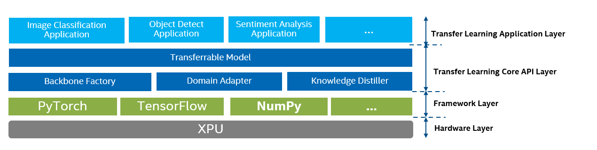
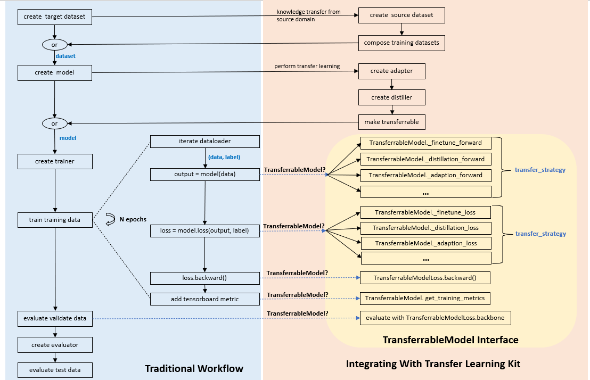

# Transfer Learning Kit

## 1. Usage

The transfer learning kit is easily integrated following the follow steps without any modification on original model, for example:
```commandline
model = ... # orignal model
model = make_transferrable_with_finetune(model,loss,init_weight,finetunner)
```
The new generated model act the same role as original model, and both can replace each other.

There are many APIs for many transfer learning strategies:

1. `make_transferrable_with_finetune`：transfer knowledge from a pretrained model to the same type model with pretraining-finetuning strategy.
   ```
   make_transferrable_with_finetune(model,loss,init_weight,finetunner)
   ```
   - model: the backbone model. If model does not have loss method, then use loss argument.
   - loss: loss function for model,signature: loss(output_logit, label). If model has loss attribute, then loss could be none.
   - init_weight: init_weight function for model to weight initialization, signature: init_weight(model). If model has init_weight attribute, then init_weight could be none.
   - finetunner: a finetunner. `finetunner.finetune_network(target_network)` is used to finetune a target_network. The available Finetunner could be found in `engine_core/finetunner`.

2. `make_transferrable_with_knowledge_distillation`: transfer knowledge from a pretrained teacher model to a student model with distillation strategy.
   ```
   make_transferrable_with_knowledge_distillation(model,loss,init_weight,distiller,distiller_feature_size,
                       distiller_feature_layer_name,enable_target_training_label)
   ```
   - model: the backbone model. If model does not have loss method, then use loss argument.
   - loss: loss function for model,signature: loss(output_logit, label). If model has loss attribute, then loss could be none.
   - init_weight: init_weight function for model, signature: init_weight(model). If model has init_weight attribute, then init_weight could be none.
   - distiller: a distiller. It is a DNN for distillation. The available Distiller could be found in `engine/distiller`.
   - distiller_feature_size: input feature size of distiller.
   - distiller_feature_layer_name: specify the layer output, which is from model, as input feature of distiller.
   - enable_target_training_label: During training, whether use target training label or not.

3. `make_transferrable_with_domain_adaption`: transfer knowledge from similar domain data (called source domain data) to target domain data with domain adaption strategy.
   ```
   make_transferrable_with_domain_adaption(model,loss,init_weight,adapter,
                                            adapter_feature_size, adapter_feature_layer_name,
                                            training_dataloader, adaption_source_domain_training_dataset,
                                            enable_target_training_label)
   ```  
   - model: the backbone model. If model does not have loss method, then use loss argument.
   - loss: loss function for model,signature: loss(output_logit, label). If model has loss attribute, then loss could be none.
   - init_weight: init_weight function for model, signature: init_weight(model). If model has init_weight attribute, then init_weight could be none.
   - adapter: an adapter. It is a DNN for domain adapter. The available Distiller could be found in `engine/adapter`
   - adapter_feature_size: input feature size of adapter.
   - adapter_feature_layer_name: specify the layer output, which is from model, as input feature of adapter.
   - training_dataloader: training dataloader.
   - adaption_source_domain_training_dataset: source domain training dataset for adaption. 
   - enable_target_training_label:  During training, whether use target training label or not.
    
4. `make_transferrable_with_finetune_and_domain_adaption`: the combination of finetune and domain adaption.
   ```
   make_transferrable_with_finetune_and_domain_adaption(model,loss,init_weight,finetunner,adapter,
                                            adapter_feature_size, adapter_feature_layer_name,
                                            training_dataloader, adaption_source_domain_training_dataset,
                                            enable_target_training_label
   ```

5. `make_transferrable_with_knowledge_distillation_and_domain_adaption`: the combination of distillation and domain adaption.
   ```
   make_transferrable_with_knowledge_distillation_and_domain_adaption(model,loss,init_weight,distiller,adapter,
                                            distiller_feature_size,distiller_feature_layer_name,
                                            adapter_feature_size, adapter_feature_layer_name,
                                            training_dataloader, adaption_source_domain_training_dataset,
                                            enable_target_training_label)
   ```

We provide decorator to decorate Model class to be transferrable, for example:
```
@transferrable_with_finetune(loss,init_weight,finetunner)
class ABCModel(torch.nn.Module):
   def __init__(self):
      # Don't use 'super(ABCModel, cls).__new__(cls)', 
      # because it raises TypeError: super() argument 1 must be type, not function
      super().__init__()
      self.m = torchvision.models.resnet18(pretrained=True)
   def forward(self,x):
      return self.m(x)

model = ABCModel() # model will be transferrable
```
There are many decorators corresponding to many transfer learning strategies:
```
transferrable_with_finetune(loss,init_weight,finetunner)
transferrable_with_knowledge_distillation(loss,init_weight,distiller,
                                                   distiller_feature_size,distiller_feature_layer_name,
                                                   enable_target_training_label)
transferrable_with_domain_adaption(loss,init_weight,adapter,
                                            adapter_feature_size, adapter_feature_layer_name,
                                            training_dataloader, adaption_source_domain_training_dataset,
                                            enable_target_training_label)
transferrable_with_finetune_and_domain_adaption(loss,init_weight,finetunner,adapter,
                                            adapter_feature_size, adapter_feature_layer_name,
                                            training_dataloader, adaption_source_domain_training_dataset,
                                            enable_target_training_label)
transferrable_with_knowledge_distillation_and_domain_adaption(loss,init_weight,distiller,adapter,
                                            distiller_feature_size,distiller_feature_layer_name,
                                            adapter_feature_size, adapter_feature_layer_name,
                                            training_dataloader, adaption_source_domain_training_dataset,
                                            enable_target_training_label)
```

**Notes**: If we need to logging the training loss or training metrics, we suggest to distinguish the new model and the original model, because maybe we want to log more details about transfer learning:
  ```
  for (cur_step,(data, label)) in enumerate(train_dataloader):
     ...
     if cur_step % logging_interval == 0:
          if isinstance(model,TransferrableModel): # new model metrics
               metric_values = model.get_training_metrics(output,label,loss_value,metric_fn_map)
          else: # original model metrics
               ...
  ```

## 2. Project Structure

```
src/
   dataset/ -------------------------------------------------- built-in datasets and helper function 
           composed_dataset.py ------------------------------- compose multi domain datasets
           image_list.py ------------------------------------- dataset for MNIST
           office31.py --------------------------------------- dataset for office31
           utils.py ------------------------------------------ dataset helper function
   engine_core/ ---------------------------------------------- transfer learning engine
              adapter/ --------------------------------------- domain adapters
                     adversarial/ ---------------------------- adversarial domain adapters
                                 adversarial_adapter.py ------ base adversarial domain adapter
                                 cdan_adapter.py ------------- cdan domain adapter
                                 dann_adapter.py ------------- dann domain adapter
                                 grl.py ---------------------- Gradient Reverse Layer
                     factory.py ------------------------------ domain adapter factory  
              backbone/ -------------------------------------- backbone networks
                      factory.py ----------------------------- backbone factory
                      lenet.py ------------------------------- built-in lenet network
              distiller/ ------------------------------------- knowledge distillers
                      basic_distiller.py --------------------- basic knowledge distiller
              finetunner/ ------------------------------------ finetunners
                        basic_distiller.py ------------------- basic distiller
              transfeerable_model.py ------------------------- the core interface to make a model transferrable
   training/ ------------------------------------------------- training helper
              metrics.py ------------------------------------- evaluation metrics
              train.py --------------------------------------- Trainer and Evaluator for training and evaluating
              utils.py --------------------------------------- helper function for training
   main.py --------------------------------------------------- the main file  
test/ -------------------------------------------------------- pytest unit test                      
```

## 3. Project Components

1. **Backbone Factory** : creates a backbone net according to predefined backbone or user-provided backbone to make basic prediction 
2. **Task Finetunner**: creates a pretrained finetuning schema (called “finetunner”) to transfer knowledge from pretrained model to target model
3. **Domain Adaptor** : creates a domain adaption net (called “adaptor”) to transfer knowledge from source domain to target domain 
4. **Knowledge Distiller** : creates a knowledge distillation net (called “distiller”) to transfer knowledge from pretrained model to target model 
5. **Transferrable Model** : creates a customized and transferrable model which is a wrapper of backbone, according to the backbone, adaptor and distiller 



## 4. WorkFlow

Our workflow is the Traditional Workflow with Transfer Learning Kit integrated.

1. Traditional Workflow: It is up to the user. For example:
   ```commandline
    create  target dataset
    create  model
    create trainer
    train training data
    evaluate validate data
    create evaluator
    evaluate test data
   ```
   And the training sub-workflow maybe:
   ```commandline
    iterate dataloader
    output = model(data)
    loss = model.loss(output, label) 
    loss.backward()
    add tensorboard metric
   ```
   For convenience of discussion, we omit some details here, for example, the creation of optimizer.

2. Transfer Learning Kit: It is an effective and convenient tool, which is used to asign Traditional Workflow the power of transfer learning by replacing some components , for example, the dataset and the model. 

