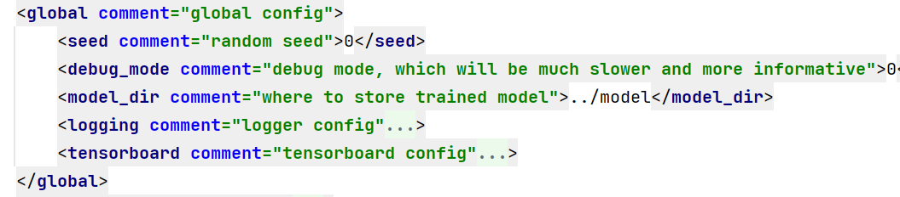
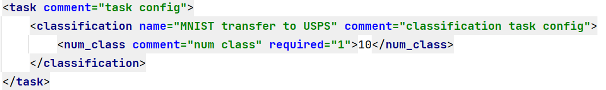
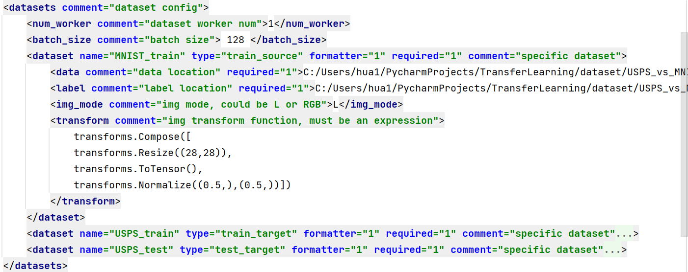
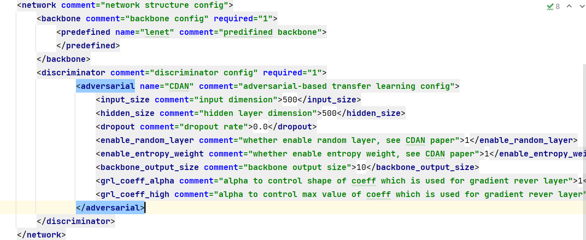

# Transfer Learning Kit

## 1. Project Structure

```
src/
   dataset/ -------------------------------------------------- datasets and helper function 
   engine_core/ ---------------------------------------------- transfer learning engine
              backbone/ -------------------------------------- backbone network
                      factory.py ----------------------------- backbone factory
              discriminator/ --------------------------------- discriminator network
                           adversarial/ ---------------------- adversarial deep discriminator
                           traditional/ ---------------------- traditional deep discriminator
                           factory.py ------------------------ discriminator factory
              model_manager.py ------------------------------- to manage learned target model
              task_config.xml -------------------------------- transfer learning config file
              task_manager.py -------------------------------- transfer learning task manager
              transfer_learning_engine.py -------------------- the core class to perform transer learning
              utils.py --------------------------------------- helper function to perform transfer learning
   main.py --------------------------------------------------- the main file                         
```

## 2. WorkFlow


1. `TaskManager` read config from `task_config.xml`, and will create datasets, backbone network, discriminator network, model manager, tensorboard writer, logger. Furthermore, TaskManger will set hyper-parameters such as learning rate, early stopping tolerance, max epoch etc.
2. All components and the TaskManager will be passed to TLEngine constructor:
   - `_train_epoch`: to perform transfer learning training.
   - `_evaluate_epoch`: to perform transfer learning evaluating, which only focuses on target domain test data.

## 3. Task Config


1. `global` : global config, such as random seed, debug mode, model dir, logging, tensor board etc.

   
2. `task` : task config, such as task type(classification or regression), num class

   
3. `datasets`: dataset config, such as num worker, batch size, dataset type(train_source or train_target or test_target), data location, label location, img mode, transform etc.
   `USPS_vs_MNIST` datasets is on 'BDF Storage & E2E - General/New Projects/2022_06 Transfer Learning/dataset_example/USPS_vs_MNIST.zip'

   
5. `network`: network structure config, such as backbone network, discriminator network.

   
