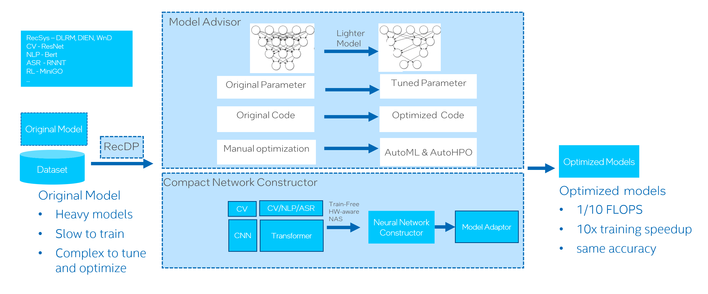

# [Intel® End-to-End AI Optimization Kit](https://github.com/intel/e2eAIOK)

# INTRODUCTION

## Problem Statement

Modern End to End AI pipeline life cycle is quite complicate with a complex pipeline including data processing, feature engineering, model development, and model deployment & maintenance. The iterative nature for feature engineering, model testing and hyper-parameter optimization makes the process more time-consuming. This complexity creates an entry-barrier for novice and citizen data scientists who might not have such expertise or skills.  Meanwhile, people tend to develop larger and larger models to get better performance, which are quite often over-parameterized.  Those overparameterized models not only poses significant challenges on AI hardware infrastructure as they require expensive computation power for training, but also posed a challenge when try to deploy in resource constraint environment which is a common need.

## Solution with Intel® End-to-End AI Optimization Kit

Intel® End-to-End AI Optimization Kit is a composable toolkits for E2E AI optimization to deliver high performance lightweight networks/models efficiently on commodity HW like CPU, intending to make E2E AI pipelines faster, easier and more accessible.

Making AI Faster: It reduces E2E time on CPU to an acceptable range throughput full pipeline optimization and improved scale-up/out capability on Intel platforms with Intel optimized framework and toolkits, delivers popular lighter DL Models with close enough performance and significantly higher inference throughput.

Making AI Easier: It automates provides simplified toolkits for data processing, distributed training, and compact neural network construction, automates E2E AI pipeline with click to run workflows and can be easily plugged to third party ML solutions/platforms as an independent composable component.

Making AI more accessible:  Through built-in optimized, parameterized models generated by smart democratization advisor and domain-specific, neural architected search (NAS) based network constructure, it brings complex DL to commodity HW, everyone can easily access AI on existing CPU clusters without the need to be an expert on data engineering and data science.

## This solution is intended for

This solution is intended for citizen data scientists, enterprise users, independent software vendor and partial of cloud service provider.

# ARCHITECTURE

## Intel® End-to-End AI Optimization Kit

Intel® End-to-End AI Optimization Kit is a composable toolkits for E2E AI optimization to deliver high performance lightweight networks/models efficiently on commodity HW. It is a pipeline framework that streamlines AI optimization technologies in each stage of E2E AI pipeline, including data processing, feature engineering, training, hyper-parameter tunning, and inference. Intel® End-to-End AI Optimization Kit delivers high performance, lightweight models efficiently on commodity hardware.

## The key components are

* [RecDP](RecDP/README.md):  A parallel data processing and feature engineering lib on top of Spark, and extensible to other data processing tools. It provides abstraction API to hide Spark programming complexity, delivers optimized performance through adaptive query plan & strategy, supports critical feature engineering functions on Tabular dataset, and can be easily integrated to third party solutions.  

* [Smart Democratization Advisor (SDA)](e2eAIOK/SDA/README.md): A user-guided tool to facilitate automation of built-in model democratization via parameterized models, it generates yaml files based on user choice, provided build-in intelligence through parameterized models and leverage SigOpt for HPO. SDA converts the manual model tuning and optimization to assisted autoML and autoHPO. SDA provides a list of build-in optimized models ranging from RecSys, CV, NLP, ASR and RL.

* Neural Network Constructor: A neural architecture search technology and transfer learning based component to build compact neural network models for specific domains directly. It includes two componments, [DE-NAS](e2eAIOK/DeNas/README.md) and [Model Adapter](e2eAIOK/ModelAdapter/README.md). DE-NAS is a multi-model, hardware aware, train-free neural architecture search approach to build models for CV, NLP, ASR directly. Model Adapter leverages transfer learning model adaptor to deploy the models in user’s production environment.

For more information, you may [read the docs](https://github.com/intel/e2eAIOK).


# Getting Started

## Installing

### Install with Baremetal Environment

 - To install all components:
   - To install e2eAIOK in baremetal environment, use `pip install e2eAIOK`
   - To install latest nightly build, use `pip install e2eAIOK --pre`

 - To install each individual component:
   - To install SDA, use `pip install e2eAIOK-sda`
   - To install DE-NAS, use `pip install e2eAIOK-denas`
   - To install Model Adapter, use `pip install e2eAIOK-ModelAdapter`

### Install with Docker Environment
``` bash
git clone https://github.com/intel/e2eAIOK.git
cd e2eAIOK
git submodule update --init --recursive
python scripts/start_e2eaiok_docker.py --backend [tensorflow, pytorch, pytorch112] --dataset_path ../ --workers host1, host2, host3, host4 --proxy "http://addr:ip"
```

Intel® End-to-End AI Optimization Kit provides step-by-step demos. Once completed installtion, please refer to the Demo section to use the click-to-run notebooks on colab or get familar with the APIs of each individual componment for a specific workload. 

## Demos

* Built-in Models
  * [DLRM](demo/builtin/dlrm/DLRM_DEMO.ipynb) - RecSys, PyTorch
  * [DIEN](demo/builtin/dien/DIEN_DEMO.ipynb) - RecSys, TensorFlow
  * [WND](demo/builtin/wnd/WND_DEMO.ipynb) - RecSys, TensorFlow
  * [RNNT](demo/builtin/rnnt/RNNT_DEMO.ipynb) - Speech Recognition, PyTorch
  * [RESNET](demo/builtin/resnet/RESNET_DEMO.ipynb) - Computer vision, TensorFlow
  * [BERT](demo/builtin/bert/BERT_DEMO.ipynb) - Natual Language Processing, TensorFlow
  * [MiniGo](demo/builtin/minigo/MiniGo_DEMO.ipynb) - minimalist engine modeled after AlphaGo Zero, TensorFlow

* Neural network constructor 

  * DE-NAS demos:
    * [DE-NAS Overview](demo/denas/DENAS_SUMMARY.ipynb) 
      * [CNN](demo/denas/computer_vision/DENAS_CNN_DEMO.ipynb) - Computer Vision, PyTorch
      * [ViT](demo/denas/computer_vision/DENAS_ViT_DEMO.ipynb) - Computer Vision, PyTorch
      * [BERT](demo/denas/bert/DENAS_BERT_DEMO.ipynb) - NLP, PyTorch
      * [ASR](demo/denas/asr/DENAS_ASR_DEMO.ipynb) - Speech Recognition, PyTorch
      * [BERT Huggingface](demo/denas/hf/DENAS_HF_DEMO.ipynb) - Hugging Face models, PyTorch
  
  * Model Aadapter demos
     * [Model Adapter Overview](demo/ma/Model_Adapter_Summary.ipynb) 
       * [Finetuner](demo/ma/finetuner/Model_Adapter_Finetuner_Walkthrough_ResNet50_CIFAR100.ipynb) - Computer Vision, Image Classification, ResNet50, PyTorch
       * [Distiller](demo/ma/distiller/Model_Adapter_Distiller_Walkthrough_VIT_to_ResNet18_CIFAR100.ipynb) - Computer Vision, Image Classification, ResNet18, PyTorch
       * [Domain Adapter](demo/ma/domain_adapter/Model_Adapter_Domain_Adapter_Walkthrough_Unet_KITS19.ipynb) - Computer Vision, Medical Segmentation, 3D Unet, PyTorch

## Performance

* [E2E RecSys Performance](docs/source/e2e_recsys_performance.md) - DLRM, DIEN, WnD
* [SDA Model Performance](docs/source/sda_model_performance.md) - ResNet, BERT, RNN-T, MiniGo
* [DE-NAS Performance](docs/source/denas_performance.md) - CNN, ViT, BERT, ASR

## Papers and Blogs

* [The Parallel Universe Magazine - Accelerate AI Pipelines with New End-to-End AI Kit](https://www.intel.com/content/www/us/en/developer/articles/technical/accelerate-ai-with-intel-e2e-ai-optimization-kit.html)
* [Multi-Model, Hardware-Aware Train-Free Neural Architecture Search](https://community.intel.com/t5/Blogs/Tech-Innovation/Artificial-Intelligence-AI/Multi-Model-Hardware-Aware-Train-Free-Neural-Architecture-Search/post/1479863)
* [SigOpt Blog - Enhance Multi-Model Hardware-Aware Train-Free NAS with SigOpt](https://sigopt.com/blog/enhance-multi-model-hardware-aware-train-free-nas-with-sigopt)
* [The Intel® SIHG4SR Solution for the ACM RecSys Challenge 2022](https://www.intel.com/content/www/us/en/developer/articles/technical/sihg4sr-graph-solution-for-recsys-challenge-2022.html)
* [ACM - SIHG4SR: Side Information Heterogeneous Graph for Session Recommender](https://dl.acm.org/doi/abs/10.1145/3556702.3556852)
* [ICYMI – SigOpt Summit Recap Democratizing End-to-End Recommendation Systems](https://sigopt.com/blog/icymi-sigopt-summit-recap-democratizing-end-to-end-recommendation-systems-with-jian-zhang/)
* [The SigOpt Intelligent Experimentation Platform](https://www.intel.com/content/www/us/en/developer/articles/technical/sigopt-intelligent-experimentation-platform.html#gs.gz2ls6)
* [SDC2022 - Data Platform for End-to-end AI Democratization](https://storagedeveloper.org/events/sdc-2022/agenda/session/326)
* [“Model Adapter”: Enhance Your AI Pipeline with Efficient Knowledge Transfer](https://community.intel.com/t5/Blogs/Tech-Innovation/Artificial-Intelligence-AI/Model-Adapter-Enhance-Your-AI-Pipeline-with-Efficient-Knowledge/post/1499303)


## Getting Support

* [Github Issues](https://github.com/intel/e2eAIOK/issues)
