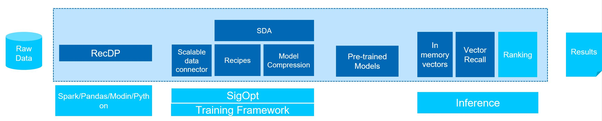

# Hydro.ai

Hydro.ai is the project code name to democratize End-to-End AI on CPU. It is initiated by Intel AIA, aiming to provide simple experience for democratized END-TO-END model training leveraging Intel oneAPI aikit, Intel sigopt, and Intel Nerual Compressor.

# Introduction

Modern end to end machine learning or deep learning system usually includes a lifecycle of data processing, feature engineering, training, inference and serving. Each different stage might has different challenges, for example, the data to be processed might be huge, and thus require a signficant amount of time to process the data and the data ETL and pre-processing time often take much more time than training. For feature engineering phase, usually numerous sets of new features need to be created, and then tested for effectiveness. For model training, one of the entry barrier is the model could be quite complex and usually requires lots of expertise to design, understand, tune and deploy the models. What makes things worse is one usually needs to repeate the experiements of the ETL, feature engineering, training and evaluation gprocess for many times on many models, to get the best model, which requires signficant amount of computational resources and is time-consuming. 

# End-to-End AI democratization 

One approach to resolve those challenges is AI democratization, which trying to make AI accessabile & affordable to every organization and every data scientist. There are a lot of things to be democratized, including: 
1. Data accessibility & quality, where you make the data access easier and simpler; building a data platform to democratize the data management - simplify data ingestion, data explore, processing and visulaization. 
2. Storage and compute platforms, instead of running the AI on hi-cost GPU, run it on democratized commodity hardware with auto-scaling. 
3. Algorithms - Democratize the use, development and sharing of ML & DL algorithms; reduce the engry barrier with automatic model searching, AutoML
4. Model development - select the most suitalbe models for users, democratize the end to end model development 
5. Market place - simply how you access, use, exchange and monetization of data, algorithm, models, and outcomes 


# BlueWhale 

Bluewhale is the project to democratize AI on CPU, starting from E2E recommender systems. The strategy is to bring E2E AI to existing CPU installation base with good-enough performance and zero additional cost, it drives the AI portaion on CPU and drive CPU/GPU balance in E2E AI. As a start, Bluewhale democrate recommender systems on distributed CPU clusters through different optimization of each machine learning life cycle phases. 

# Key architecture 

Below firgure showed the architecture diagram of Bluewhale. 



# Major componments 

Here are the major componments of Bluewhale: 
1. RecDP -  scalable data processing and feature engineering kit based on Spark and Modin 
2. Distributed data connector - a distirbuted data connector based on PetaStorm  supporting training framework to load data from distributed filesystem, and provide enhanced capabilities like data caching, sharing. 
3. Smart Democratization Advisor - a human intelligence enhanced toolkit to generate sigopt recipes for Sigopt AutoML. It first generate optimized SigOpt recipes based on user choices and built-in intelligence, including optimized model parameters, optimized training framework parameters and set the training cluster environment, training framework parameters, and final target metrcis. Then it kicks off Siopt AutoML for optimization experiments to generate the best model. 
4. Model Compression - A model compression toolkit that supports botch train from scratch and pre-trained models, to simply the model tuning process and generate ligher models 
5. Inference acclerators - enhanced in memory vectors and vector recall utilits to speedup vector recall process. 
6. Recipes - four proof of concept workloads including DLRM, DIEN, WnD, RecSys, with ready to run notebooks to showcase the benefit of the democratized models. 
7. deployment kit - a container with deployment kit to have users have a quick try. 
8. Auto scaling - Bluewhale support autoscaling on the public cloud, users can easiliy scale the work to multiple CPU nodes. 

# In-Stock-Models

Currently four recommender system workloads were supported: including DLRM, DIEN, WnD and RecSys. The Bluewhale E2E AI democratization kit significantly improved the performance of those models on distributed CPU cluster, reduced the performance gap of CPU to GPU from 100x to < 2x, using the same dataset and the same AUC metrics. The key optimizations Bluewhale brought can be categorized as: 

# How to Use

What is the input:
* in-stock model name or your own model [train.py](example/example_train.py), current supported in-stock models are: DLRM, WnD, DIEN
* dataset as listed structure:
  * train - folder
  * validate - folder
  * [metadata.yaml](example/metadata.yaml)
* modication of [hydroai_defaults.conf](conf/hydroai_defaults.conf)

How to run:
``` bash
# For in-stock model with sigopt
SIGOPT_API_TOKEN=${SIGOPT_TOKEN} python run_hydroai.py --data_path ${dataset_path} --model_name [dlrm, wnd, dien, pipeline_test]

# For in-stock model without sigopt
python run_hydroai.py --data_path ${dataset_path} --model_name [dlrm, wnd, dien, pipeline_test] --no_sigopt

# For user-define model
python run_hydroai.py --data_path ${dataset_path} --model_name udm --executable_python ${python_path} --program ${path to your train.py}
```

# Quick Start
``` bash
docker run -it --privileged --network host --device=/dev/dri -v ${dataset_path}:/home/vmagent/app/dataset -v `pwd`:/home/vmagent/app/hydro.ai -w /home/vmagent/app/ docker.io/xuechendi/oneapi-aikit:hydro.ai /bin/bash
source /opt/intel/oneapi/setvars.sh --ccl-configuration=cpu_icc --force
# optional - config proxy
source /home/vmagent/app/hydro.ai/config_proxy
# optional - start sshd service
sudo service ssh start
bash config_passwdless_ssh.sh ${other_train_node}
```

# Quick Example
### Prepare sigopt TOKEN
[https://app.sigopt.com/tokens/info](https://app.sigopt.com/tokens/info)

### Pipeline Test example
```
SIGOPT_API_TOKEN=${SIGOPT_TOKEN} python run_hydroai.py --model_name pipeline_test --data_path /home/vmagent/app/datas
et/test_pipeline/
```


# Advanced
How to define a new Advisor under hydro.ai/SDA/modeladvisor, follow below template
``` python
import subprocess
import yaml
import logging
import time
import sys
from common.utils import *

from SDA.modeladvisor.BaseModelAdvisor import BaseModelAdvisor

class NewAdvisor(BaseModelAdvisor):
    def __init__(self, dataset_meta_path, train_path, eval_path, settings):
        super().__init__(dataset_meta_path, train_path, eval_path, settings)
        logging.basicConfig(level = logging.INFO,format = '%(asctime)s - %(name)s - %(levelname)s - %(message)s')
        self.logger = logging.getLogger('sigopt')
    
    ###### Implementation of required methods ######

    def update_metrics(self):
        metrics = []
        
        # load result from result.txt or captured by train_model function
        # change below codes according to your scenario
        metrics.append({'name': 'accuracy', 'value': self.mean_accuracy})
        metrics.append({'name': 'training_time', 'value': self.training_time})
        
        # keep these for return
        self.params['model_parameter']['metrics'] = metrics
        return self.params['model_parameter']['metrics']

    def initialize_model_parameter(self, assignments = None):
        # This function is used to init parameter without sigopt
        # assignments are recorded best parameters
        config = {}
        tuned_parameters = {}
        if assignments:
            # modify below parameters based on your model
            tuned_parameters['max_depth'] = assignments['max_depth']
            tuned_parameters['learning_rate'] = assignments['learning_rate']
            tuned_parameters['min_split_loss'] = assignments['min_split_loss']
        else:
            # modify below parameters based on your model
            tuned_parameters['max_depth'] = 11
            tuned_parameters['learning_rate'] = float(0.9294458527831317)
            tuned_parameters['min_split_loss'] = float(6.88375281543753)
            
        # keep below lines
        config['tuned_parameters'] = tuned_parameters
        self.params['model_parameter'] = config
        self.params['model_saved_path'] = os.path.join(self.params['save_path'], get_hash_string(str(tuned_parameters)))
        return config
    
    def generate_sigopt_yaml(self, file='test_sigopt.yaml'):
        # This function is used to init parameter for sigopt
        config = {}
        # modify based on your model
        config['project'] = 'hydro.ai'
        config['experiment'] = 'sklearn'
        parameters = [{'name': 'max_depth', 'bounds': {'min': 3, 'max': 12}, 'type': 'int'}, 
                      {'name': 'learning_rate', 'bounds': {'min': 0.0, 'max': 1.0}, 'type': 'double'},
                      {'name': 'min_split_loss', 'bounds': {'min': 0.0, 'max': 10}, 'type': 'double'}]
        user_defined_parameter = self.params['model_parameter']['parameters'] if ('model_parameter' in self.params) and ('parameters' in self.params['model_parameter']) else None
        config['parameters'] = parameters
        if user_defined_parameter:
            config['parameters'].update(user_defined_parameter)
        config['metrics'] = [
            {'name': 'accuracy', 'strategy': 'optimize', 'objective': 'maximize'},
            {'name': 'training_time', 'objective': 'minimize'}
        ]
        user_defined_metrics = self.params['model_parameter']['metrics'] if ('model_parameter' in self.params) and ('metrics' in self.params['model_parameter']) else None
        if user_defined_metrics:
            config['metrics'].update(user_defined_metrics)
        config['observation_budget'] = self.params['observation_budget']
        
        # save to local disk
        saved_path = os.path.join(self.params['save_path'], file)
        with open(saved_path, 'w') as f:
            yaml.dump(config, f)
        return config
  
    def train_model(self, args):
        start_time = time.time()
        
        # modify based on your model parameter
        max_depth = args['model_parameter']["tuned_parameters"]['max_depth']
        learning_rate = args['model_parameter']["tuned_parameters"]['learning_rate']
        min_split_loss = args['model_parameter']["tuned_parameters"]['min_split_loss']
        model_saved_path = args['model_saved_path']
        cmd = []
        cmd.append(f"/opt/intel/oneapi/intelpython/latest/bin/python")
        cmd.append(f"/home/vmagent/app/hydro.ai/example/sklearn_train.py")
        cmd.append(f"--max_depth")
        cmd.append(f"{max_depth}")
        cmd.append(f"--learning_rate")
        cmd.append(f"{learning_rate}")
        cmd.append(f"--min_split_loss")
        cmd.append(f"{min_split_loss}")
        cmd.append(f"--saved_path")
        cmd.append(f"{model_saved_path}")
        self.logger.info(f'training launch command: {cmd}')
        
        # run train using cmdline, by doing so, we can use different python conda env
        output = subprocess.check_output(cmd)
        self.mean_accuracy = float(output)        
        self.training_time = time.time() - start_time
        
        # call update metrics function to make sure metrics is prepared
        metrics = self.update_metrics()
        return self.training_time, model_saved_path, metrics

```

Parameters explaination
``` yaml
# GLOBAL SETTINGS ###
# below is for system configuration
# use self.params['ppn'] to get configuration in your own advisor
observation_budget: 1
save_path: /home/vmagent/app/hydro.ai/result/
ppn: 1
# you can add more here
#
# model_parameter ###
# below is for sigopt or w/ sigopt model_parameter configuration
# use self.params['model_parameter']['parameters'] to get in your own advisor
model_parameter:
  project: hydro.ai
  experiment: sklearn
# parameters will be used to submit to sigopt
# please follow [https://app.sigopt.com/docs/api_reference/object_parameter] 
  parameters:
    - name: max_depth
      bounds:
        min: 3
        max: 12
      type: int
    - name: learning_rate
      bounds:
        min: 0.0
        max: 1.0
      type: double
# metrics will be used to submit to sigopt
# please follow [https://app.sigopt.com/docs/api_reference/object_metric]
  metrics:
    - name: accuracy
      strategy: optimize
      objective: maximize
    - name: training_time
      objective: minimize
# tuned_parameter is required to be pre-defined in without sigopt scenario through Advisor.initialize_model_parameter(self, assignments = None) method
# for with sigopt scenario, tuned_parameter will be set by hydro.ai after it received sigopt suggestion
# Advisor should expect self.params['model_parameter']['tuned_parameters'] is ready in Advisor.train_model(self, args) method
  tuned_parameter:
    max_depth: 11
    learning_rate: 0.9294
    min_split_loss: 6.883
```

# Perforamnce 
ToBeAdded. 
