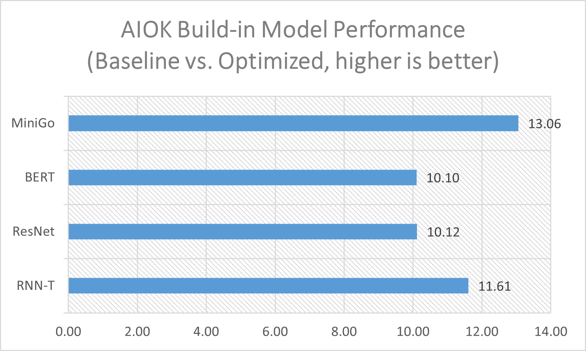
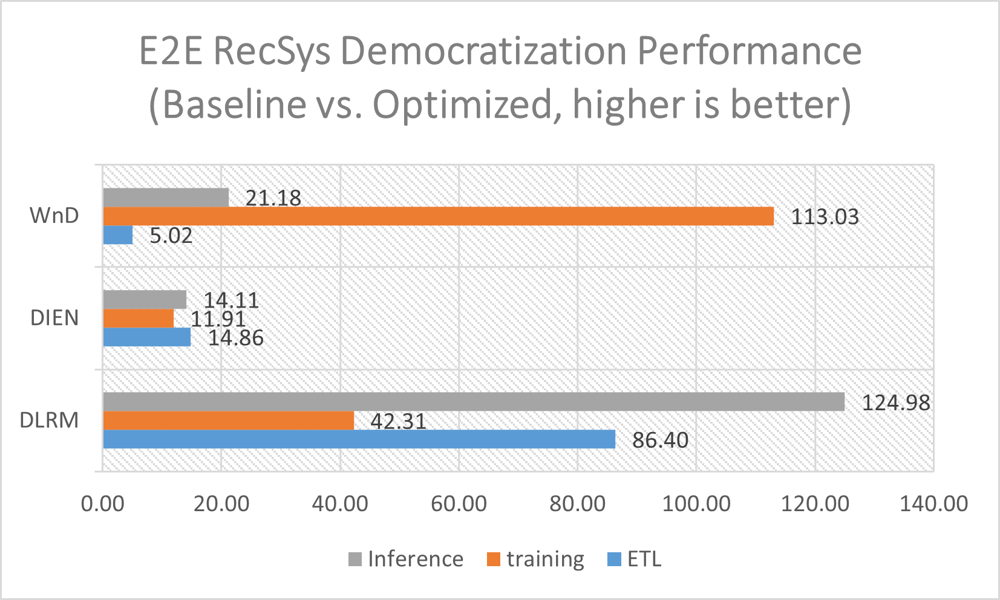

# [Intel® End-to-End AI Optimization Kit](https://github.com/intel/e2eAIOK)

# INTRODUCTION

## Problem Statement

Modern End to End AI pipeline life cycle is quite complicate with a complex pipeline including data processing, feature engineering, model development, and model deployment & maintenance. The iterative nature for feature engineering, model testing and hyper-parameter optimization makes the process more time-consuming. This complexity creates an entry-barrier for novice and citizen data scientists who might not have such expertise or skills.  Meanwhile, people tend to develop larger and larger models to get better performance, which are quite often over-parameterized.  Those overparameterized models not only poses significant challenges on AI hardware infrastructure as they require expensive computation power for training, but also posed a challenge when try to deploy in resource constraint environment which is a common need.

## Solution with Intel® End-to-End AI Optimization Kit

Intel® End-to-End AI Optimization Kit is a composable toolkits for E2E AI optimization to deliver high performance lightweight networks/models efficiently on commodity HW like CPU, intending to make E2E AI pipelines faster, easier and more accessible.

Making AI Faster: It reduces E2E time on CPU to an acceptable range throughput full pipeline optimization and improved scale-up/out capability on Intel platforms with Intel optimized framework and toolkits, delivers popular lighter DL Models with close enough performance and significantly higher inference throughput.

Making AI Easier: It automates provides simplified toolkits for data processing, distributed training, and compact neural network construction, automates E2E AI pipeline with click to run workflows and can be easily plugged to third party ML solutions/platforms as an independent composable component.

Making AI more accessible:  Through built-in optimized, parameterized models generated by smart democratization advisor and domain-specific, neural architected search (NAS) based network constructure, it brings complex DL to commodity HW, everyone can easily access AI on existing CPU clusters without the need to be an expert on data engineering and data science.

## This solution is intended for

This solution is intended for citizen data scientists, enterprise users, independent software vendor and partial of cloud service provider.

## Papers and Blogs

* [ICYMI – SigOpt Summit Recap Democratizing End-to-End Recommendation Systems](https://sigopt.com/blog/icymi-sigopt-summit-recap-democratizing-end-to-end-recommendation-systems-with-jian-zhang/)
* [The SigOpt Intelligent Experimentation Platform](https://www.intel.com/content/www/us/en/developer/articles/technical/sigopt-intelligent-experimentation-platform.html#gs.gz2ls6)
* [SDC2022 - Data Platform for End-to-end AI Democratization](https://storagedeveloper.org/events/sdc-2022/agenda/session/326)
* [SIHG4SR: Side Information Heterogeneous Graph for Session Recommender](https://dl.acm.org/doi/abs/10.1145/3556702.3556852)

# ARCHITECTURE

## Intel® End-to-End AI Optimization Kit

Intel® End-to-End AI Optimization Kit is a composable toolkits for E2E AI optimization to deliver high performance lightweight networks/models efficiently on commodity HW. It is a pipeline framework that streamlines AI optimization technologies in each stage of E2E AI pipeline, including data processing, feature engineering, training, hyper-parameter tunning, and inference. Intel® End-to-End AI Optimization Kit delivers high performance, lightweight models efficiently on commodity hardware.

## The key components are

* [RecDP](RecDP/README.md):  A parallel data processing and feature engineering lib on top of Spark, and extensible to other data processing tools. It provides abstraction API to hide Spark programming complexity, delivers optimized performance through adaptive query plan & strategy, supports critical feature engineering functions on Tabular dataset, and can be easily integrated to third party solutions.  

* [Smart Democratization Advisor (SDA)](e2eAIOK/SDA/README.md): A user-guided tool to facilitate automation of built-in model democratization via parameterized models, it generates yaml files based on user choice, provided build-in intelligence through parameterized models and leverage SigOpt for HPO. SDA converts the manual model tuning and optimization to assisted autoML and autoHPO. SDA provides a list of build-in optimized models ranging from RecSys, CV, NLP, ASR and RL.

* [Neural Network Constructor](e2eAIOK/DeNas/README.md): A neural architecture search technology based on component to build compact neural network models for specific domains directly. It is a multi-model, hardware aware, train-free neural architecture search approach to build models for CV, NLP, ASR directly and leverage transfer learning model adaptor to deploy the models in user’s production environment.

For more information, you may [read the docs](https://github.com/intel/e2eAIOK).


# Getting Started

## Installing

``` bash
git clone https://github.com/intel/e2eAIOK.git
git submodule update --init --recursive
cd e2eAIOK; python scripts/start_e2eaiok_docker.py --backend [tensorflow, pytorch, pytorch110, pytorch112] --dataset_path ../ --workers host1, host2, host3, host4 --proxy "http://addr:ip"
```

## Demos

* Built-in Models
  * [DLRM](demo/builtin/dlrm/DLRM_DEMO.ipynb) - [Readme](modelzoo/dlrm/README.md) - RecSys, PyTorch
  * [DIEN](demo/builtin/dien/DIEN_DEMO.ipynb) - [Readme](modelzoo/dien/README.md) - RecSys, TensorFlow
  * [WnD](demo/builtin/wnd/WND_DEMO.ipynb) - [Readme](modelzoo/WnD/README.md) - RecSys, TensorFlow
  * [RNNT](demo/builtin/rnnt/RNNT_DEMO.ipynb) - [Readme](modelzoo/rnnt/README.md) - Speech Recognition, PyTorch
  * [RESNET](demo/builtin/resnet/RESNET_DEMO.ipynb) - [Readme](modelzoo/resnet/README.md) - Computer vision, TensorFlow
  * [BERT](demo/builtin/bert/BERT_DEMO.ipynb) - [Readme](modelzoo/bert/README.md) - Natual Language Processing, TensorFlow
  * [MiniGO](demo/builtin/minigo/MiniGo_DEMO.ipynb) - [Readme](modelzoo/minigo/README.md) - minimalist engine modeled after AlphaGo Zero, TensorFlow

* Neural network constructor with DE-NAS demos: 
  * [Computer Vision](demo/denas/computer_vision/DENAS_COMPUTER_VISION_DEMO.ipynb) - CNN/Vit, PyTorch
  * [NLP](demo/denas/bert/DENAS_BERT_DEMO.ipynb) - BERT, PyTorch
  * [Speech Recognition](demo/denas/asr/DENAS_ASR_DEMO.ipynb) - ASR, PyTorch

## Performance

Performance results are evaluated on 4-node cluster configured with Intel(R) Xeon(R) Platinum 8358 Scalable processor.
For [MiniGO](modelzoo/minigo/README.md), [BERT](modelzoo/bert/README.md), [ResNet](modelzoo/resnet/README.md), [RNN-T](modelzoo/rnnt/README.md), Intel® End-to-End AI Optimization Kit delivered 13.06x, 10.10x, 8.77x and 14.19x training time speedup respecitvely through E2E optimizations. Please refer to corresponding model link for detailed test dataset and test method. 
> Noted: Optimized lighter models' accuracy are slightly lower: ResNet -5% accuracy, BERT -1% F1 score.



Performance results are evaluated on 4-node cluster configured with Intel(R) Xeon(R) Platinum 8358 Scalable processor.
For [WnD](modelzoo/WnD/README.md), [DIEN](modelzoo/dien/README.md) and [DLRM](modelzoo/dlrm/README.md), Intel® End-to-End AI Optimization Kit delivered 51.01x(5.02x ELT & 113.03x training), 12.67x(14.86x ELT & 11.91x training) and 71.16x(86.40x ELT & 42.31x training) E2E time speedup, 21.18x, 14.11x and 124.98x inference throughput speedup respectively. Please refer to corresponding model link for detailed test dataset and test method.




## Getting Support

* [Github Issues](https://github.com/intel/e2eAIOK/issues)
