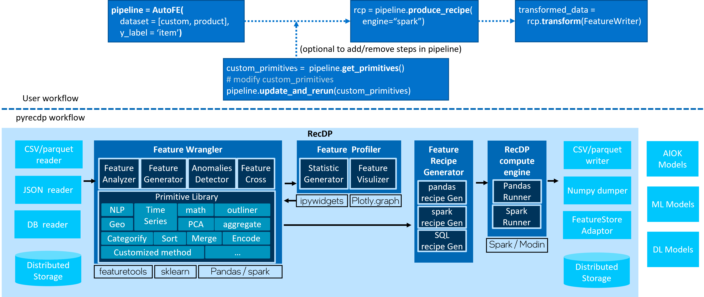

# RecDP v2.0

# INTRODUCTION
RecDP v2.0 is aiming to provide auto Data Prepartion upon spark and pandas.
* Auto Feature Enrich including:
    * feature transformation(datetime, geo_info, text_nlp, url, etc.)
    * feature cross(aggregation transformation - sum, avg, count, etc.)
* Auto anomalies detection
* Feature Profiling Visualizer
* ML/DL connector:
    * numpy based - xgboost/lightgbm
    * pytorch tensor based
    * dgl graph
    * pyG graph



# Getting Start
## use docker to setup pyrecdp
```
git clone --single-branch --branch RecDP_v2.0 https://github.com/intel-innersource/frameworks.bigdata.AIDK.git
cd frameworks.bigdata.AIDK/RecDP
python3 scripts/start_e2eaiok_docker.py
#python3 scripts/start_e2eaiok_docker.py --proxy "http://ip:port"
# open browser with http://hostname:8888
```

## Quick Example (same data, Spark took 240s and pandas took 1967s)
```
import pandas as pd
train_data = pd.read_csv("twitter_recsys_cleaned.csv")

# use recdp to do auto feature wrangling
from pyrecdp.autofe import FeatureWrangler
pipeline = FeatureWrangler(dataset=train_data, label="reply")

# switch between spark or pandas
transformed_train_data = pipeline.fit_transform(engine_type = 'spark')
# transformed_train_data = pipeline.fit_transform(engine_type = 'pandas')
```
```
# output log, spark based
# enriched from 21 features to 41 features
train_data shape is (14461760, 21)
read train data from csv took 97.07148390542716 sec
initiate autofe pipeline took 2.740308342501521 sec
Setting default log level to "WARN".
To adjust logging level use sc.setLogLevel(newLevel). For SparkR, use setLogLevel(newLevel).
23/01/11 17:13:24 WARN Utils: Service 'SparkUI' could not bind on port 4040. Attempting port 4041.
per core memory size is 1.250 GB and shuffle_disk maximum capacity is 500.0 GB                                                                               
DataframeConvert partition pandas dataframe to spark RDD took 70.351 secs
DataframeTransform took 152.755 secs, processed 14461760 rows with num_partitions as 200
DataframeTransform combine to one pandas dataframe took 10.626 secs
transform took 244.88301383145154 sec
transformed shape is (14461760, 41)
```
```
# output log, pandas based
# enriched from 21 features to 41 features
train_data shape is (14461760, 21)
read train data from csv took 102.69935449492186 sec
initiate autofe pipeline took 3.083546308800578 sec
Transformation of <function DataframeConvertFeatureGenerator.get_function_pd.<locals>.convert_df at 0x7f1cd541d940> took 0.000 secs
Transformation of <function FillNaFeatureGenerator.get_function_pd.<locals>.fill_na at 0x7f111dad1160> took 0.596 secs
Transformation of <function TypeInferFeatureGenerator.get_function_pd.<locals>.type_infer at 0x7f111dad1430> took 39.585 secs
Transformation of <function DecodedTextFeatureGenerator.get_function_pd.<locals>.generate_ft_feature at 0x7f111dad10d0> took 1539.168 secs
Transformation of <function DatetimeFeatureGenerator.get_function_pd.<locals>.generate_ft_feature at 0x7f111dad14c0> took 34.373 secs
Transformation of <function TextFeatureGenerator.get_function_pd.<locals>.generate_ft_feature at 0x7f111dad1550> took 353.720 secs
Transformation of <function DataframeTransformFeatureGenerator.get_function_pd.<locals>.transform_df at 0x7f111dad15e0> took 0.000 secs
transform took 1967.4441721253097 sec
transformed shape is (14461760, 41)
```

# More Examples
## Auto Feature Enrich Examples
* [NYC Taxi fare auto data prepration](examples/notebooks/autofe/FeatureWrangler.ipynb): An example to show how RecDP_v2.0 automatically generating datetime and geo features upon 55M records. Tested with both Spark and Pandas(featuretools) as compute engine, show 21x speedup by spark.

* [twitter auto data prepration](examples/notebooks/autofe/FeatureWrangler-recsys.ipynb): An example to show how RecDP_v2.0 automatically generating datetime, nlp features upon 14M records. Tested with both Spark and Pandas(featuretools) as compute engine, show 10x speedup by spark.

* amazon products review: To be added in near future

## Data Profiler Examples
* [NYC Taxi fare Profiler](examples/notebooks/autofe/FeatureProfiler.ipynb)[snapshot](resources/FeatureProfiler_NYC.png): An example to show RecDP_v2.0 to profile data, including infer the potential data type, generate data distribution charts.

* [twitter Profiler](examples/notebooks/autofe/FeatureProfiler_recsys.ipynb)[snapshot](resources/FeatureProfiler_recsys.png): An example to show RecDP_v2.0 to profile data, including infer the potential data type, generate data distribution charts.

## Feature Cross

* multiple table feature cross: To be added in near future

* single table feature cross: To be added in near future

## connector example

* To be added in near future

## LICENSE
* Apache 2.0

## Dependency
* Spark 3.x
* python 3.*
