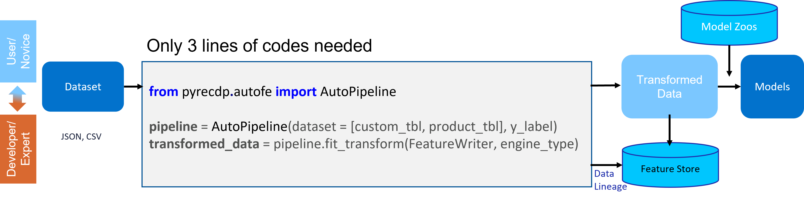

# RecDP v2.0

# INTRODUCTION

## Problem Statement

Data Preparation is an essential step to build AI pipelines 
* key data preparation capabilities: data connector, cleaning, sampling, joining, profiling, feature engineering, low-code/no-code UI, lineage etc. 
* exploration of optimal Data preparation consumes majority of Data Science time

## Solution with RecDP v2.0

* Auto pipeline
    * only 3 lines of codes required
* Pipeline Generator
    * Data Profiling:
        * Auto anomalies detection
        * Auto missing value impute
        * Profiling Visualizzation        
    * Feature Wrangling:
        * feature transformation(datetime, geo_info, text_nlp, url, etc.)
        * multiple data auto joining
        * feature cross(aggregation transformation - sum, avg, count, etc.)
    * export pipeline as JSON file, can be import to other data platform
* Pipeline Runner:
    * spark engine: convert pipeline to spark codes to run
    * pandas engine: convert pipeline to pandas codes to run
    * sql engine: convert pipeline to sql
* DataLoader:
    * parquet, csv, json, database
* FeatureWriter - ML/DL connector:
    * Data Lineage
    * Feature Store
    * numpy, csv, parquet, dgl / pyG graph


## This solution is intended for
citizen data scientists, enterprise users, independent software vendor and partial of cloud service provider.

# Getting Start
## setup with pip
```
git clone --single-branch --branch RecDP_v2.0 https://github.com/intel-innersource/frameworks.bigdata.AIDK.git
cd frameworks.bigdata.AIDK/RecDP
# install dependencies
apt-get update -y &&  DEBIAN_FRONTEND=noninteractive apt-get install -y python3 python3-pip python-is-python3 graphviz
DEBIAN_FRONTEND=noninteractive apt-get install -y openjdk-8-jre
# install recdp
python setup.py sdist
pip install dist/pyrecdp-1.0.1.tar.gz

sh start-jupyter.sh
# open browser with http://hostname:8888
```

## run


## modify pipeline (add user defined function or remove operation)
``` python
def filter_with_cond(df):
    df = df[df['Year'] <= 2018]
    return df
operation = {
    "children": [6], # will to append this new op
    "next": [7], # who will be connected to this new op
    "inline_function": filter_with_cond, # function
}
pipeline.add_operation(operation)
```
``` python
operation = {
    "idx": 6, # OP id to be deleted
    "next": [10] # who is connected to the to_be_deleted op
}
pipeline.delete_operation(operation)
```

## export pipeline
``` python
pipeline.export(file_path = "exported_pipeline.json")
```
``` json
{
    "0": {
        "children": null,
        "op": "DataFrame",
        "config": "main_table"
    },
    "1": {
        "children": [0],
        "op": "type_infer",
        "config": [
            ["pickup_datetime",["is_string","is_datetime"]],
            ["pickup_longitude",["is_numeric","is_float"]],
            ["pickup_latitude",["is_numeric","is_float"]],
            ["dropoff_longitude",["is_numeric","is_float"]],
            ["dropoff_latitude",["is_numeric","is_float"]],
            ["passenger_count",["is_numeric","is_int64","is_integer","is_categorical"]]
        ]
    },
    "2": {
        "children": [1],
        "op": "tuple",
        "config": {
            "src": ["pickup_latitude","pickup_longitude"],"dst": "pickup_coordinates"
        }
    },
    "3": {
        "children": [2],
        "op": "tuple",
        "config": {
            "src": ["dropoff_latitude","dropoff_longitude"],"dst": "dropoff_coordinates"
        }
    },
    "4": {
        "children": [3],
        "op": "fillna",
        "config": {
            "pickup_longitude": -1,
            "pickup_latitude": -1,
            "dropoff_longitude": -1,
            "dropoff_latitude": -1,
            "passenger_count": -1
        }
    },
    "5": {
        "children": [4],
        "op": "datetime_feature",
        "config": {
            "pickup_datetime": [
                ["pickup_datetime__day",["featuretools.primitives.standard.transform.datetime.day", "Day"]],
                ["pickup_datetime__month",["featuretools.primitives.standard.transform.datetime.month","Month"]],
                ["pickup_datetime__weekday",["featuretools.primitives.standard.transform.datetime.weekday","Weekday"]],
                ["pickup_datetime__year",["featuretools.primitives.standard.transform.datetime.year","Year"]],
                ["pickup_datetime__hour",["featuretools.primitives.standard.transform.datetime.hour","Hour"]]
            ]
        }
    },
    "6": {
        "children": [5],
        "op": "haversine",
        "config": {
            "['pickup_coordinates', 'dropoff_coordinates']": ["haversine_pickup_coordinates_dropoff_coordinates",["featuretools.primitives.standard.transform.latlong.haversine","Haversine"]]
        }
    },
    "7": {
        "children": [6],
        "op": "drop",
        "config": [
            "pickup_datetime",
            "pickup_coordinates",
            "dropoff_coordinates"
        ]
    },
    "8": {
        "children": [7],
        "op": "lightgbm",
        "config": {
            "label": "fare_amount",
            "metrics": "rmse",
            "objective": "regression",
            "model_file": "lightgbm_regression_label.mdl",
            "method": "predict"
        }
    }
}
```


## Quick Example
* [](https://colab.research.google.com/gist/xuechendi/de044d606e6cdc44d3005db2a0ae968d/recdp_fare_prediction.ipynb) - [nyc taxi fare](examples/notebooks/autofe/demo/nyc_taxi_workflow_train.ipynb) - geographic, datetime, lgbm regression

* [](https://colab.research.google.com/gist/xuechendi/2b8acb3eda73028635072352560139ba/recdp_fraud_detect.ipynb) - [IBM Card Transaction Fraud Detect](examples/notebooks/autofe/demo/fraud_detect_train.ipynb) - onehot encode, lgbm, binary classification 

* [](https://colab.research.google.com/gist/xuechendi/b039b8c0a40fec951b1b09c3fbb93a7b/recdp_social_media.ipynb) - [twitter recsys](examples/notebooks/autofe/demo/twitter_workflow_test.ipynb) - text nlp, datetime feature engineering  

* [](https://colab.research.google.com/gist/xuechendi/1e08668ab0e15e1e98c592f284d79dad/recdp_click_through_rate_multiple_tables.ipynb) - [outbrain](examples/notebooks/autofe/demo/outbrain_ctr_workflow_test.ipynb) - multiple table joining

* [](https://colab.research.google.com/gist/xuechendi/2f942c30dbf9b63a64cc819a61966e34/recdp_rating_prediction_amazon_review.ipynb) - [amazon product review](examples/notebooks/autofe/demo/amazon_product_review_test.ipynb) - text nlp, datetime, feature-cross

# More Examples - completed example including training

## Auto Feature Engineering vs. featuretools
* [NYC Taxi fare auto data prepration](examples/notebooks/autofe/FeatureWrangler.ipynb): An example to show how RecDP_v2.0 automatically generating datetime and geo features upon 55M records. Tested with both Spark and Pandas(featuretools) as compute engine, show 21x speedup by spark.

## load PIPELINE and execute
* [twitter pipeline re-load and execute](examples/notebooks/autofe/demo/custom_pipeline_twitter.ipynb): An example to show how RecDP_v2.0 reload pipeline from json and do execution - use RecDP as compute engine.

## Realtime Inference pipeline
* [nyc taxi fare](examples/notebooks/autofe/demo/nyc_taxi_workflow_predict.ipynb) - geographic, datetime feature engineering, lgbm

## Data Profiler Examples
* [NYC Taxi fare Profiler](resources/FeatureProfiler_NYC.png): An example to show RecDP_v2.0 to profile data, including infer the potential data type, generate data distribution charts.

* [twitter Profiler](resources/FeatureProfiler_recsys.png): An example to show RecDP_v2.0 to profile data, including infer the potential data type, generate data distribution charts.


## LICENSE
* Apache 2.0

## Dependency
* Spark 3.x
* python 3.*
