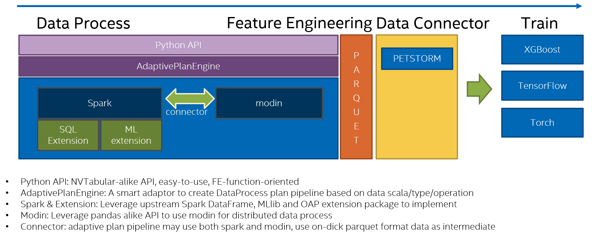

## What is RecDP 
* RecDP is a Data Process python module, specifically designed for Recommender System. 

## Objective
* Easy-to-use – simple APIs for data scientists, easy to migrate from NVTabular
* Collaborative pipeline with spark and modin - provide stableness and scalability of handling huge dataset with spark and modin as underlying distributed data process engine.
* Optimized Performance - 1) Adaptive dataframe plan decision making; 2) Intel-OAP accelerator extensions (SIMD, Cache, Native). 
* Extensible – provides plugin interface to extend intel RECO & Friesian with optimized adaptive DataProcess pipeline plan with spark and modin.
* Feature Engineer oriented – advanced feature engineering functions (target encoding) 

## Currently RecDP is proven by two use case: 
* DRLM: passed on previous NVIDIA-script fail on no-filtering dataset.
* Recsys2021: passed on previous NVIDIA-script fail on process full dataset

## Design Overview

## LICENSE
* Apache 2.0

## Dependency
* Spark 3.x
* python 3.*
