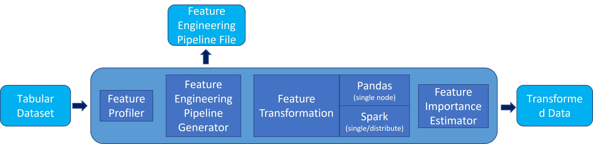
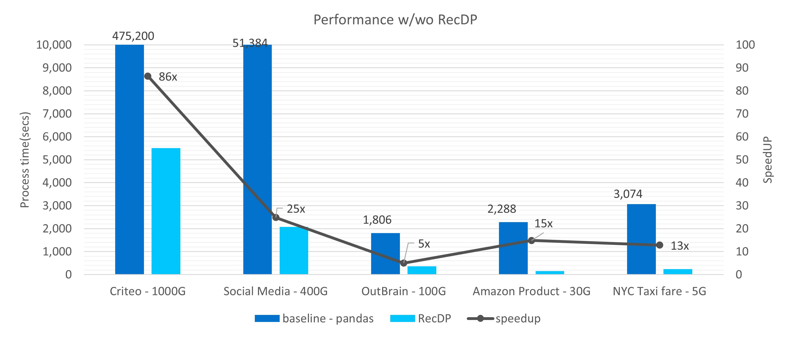
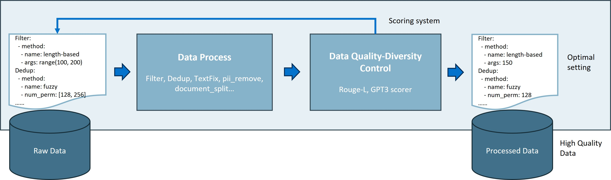

# RecDP - one stop toolkit for AI data process

We provide intel optimized solution for

* [**Auto Feature Engineering**](pyrecdp/autofe/README.md) -  Provides an automatical way to generate new features for any tabular dataset which containing numericals, categoricals and text features. It only takes 3 lines of codes to automatically enrich features based on data analysis, statistics, clustering and multi-feature interacting.
* [**LLM Data Preparation**](pyrecdp/LLM/README.md) - Provides a parallelled easy-to-use data pipeline for LLM data processing. It supports multiple data source such as jsonlines, pdfs, images, audio/vides. Users will be able to perform data extraction, deduplication(near dedup, rouge, exact), splitting, special_character fixing, types of filtering(length, perplexity, profanity, etc), quality analysis(diversity, GPT3 quality, toxicity, perplexity, etc). This tool also support to save output as jsonlines, parquets, or insertion into VectorStores(FaissStore, ChromaStore, ElasticSearchStore).

## How it works

Install this tool through pip. 

```
DEBIAN_FRONTEND=noninteractive apt-get install -y openjdk-8-jre graphviz
pip install pyrecdp[all] --pre
```

## RecDP - Tabular
[learn more](pyrecdp/autofe/README.md)

* Auto Feature Engineering Pipeline


Only **3** lines of codes to generate new features for your tabular data. Usually 5x new features can be found with up to 1.2x accuracy boost
```
from pyrecdp.autofe import AutoFE

pipeline = AutoFE(dataset=train_data, label=target_label, time_series = 'Day')
transformed_train_df = pipeline.fit_transform()
```

* High Performance on Terabyte Tabular data processing


## RecDP - LLM
[learn more](pyrecdp/LLM/README.md)

* Low-code Fault-tolerant Auto-scaling Parallel Pipeline


```
from pyrecdp.primitives.operations import *
from pyrecdp.LLM import ResumableTextPipeline

pipeline = ResumableTextPipeline()
ops = [
    UrlLoader(urls, max_depth=2),
    DocumentSplit(),
    ProfanityFilter(),
    PIIRemoval(),
    ...
    PerfileParquetWriter("ResumableTextPipeline_output")
]
pipeline.add_operations(ops)
pipeline.execute()
```

## LICENSE
* Apache 2.0

## Dependency
* Spark 3.4.*
* python 3.*
* Ray 2.7.*
