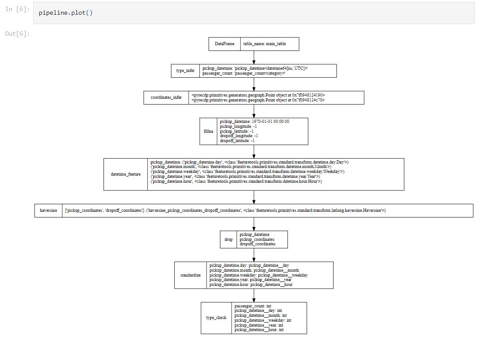

# RecDP v2.0

# INTRODUCTION

## Problem Statement

Data Preparation is an essential step to build AI pipelines 
* key data preparation capabilities: data connector, cleaning, sampling, joining, profiling, feature engineering, low-code/no-code UI, lineage etc. 
* exploration of optimal Data preparation consumes majority of Data Science time

## Solution with RecDP v2.0

* Auto pipeline
    * only 3 lines of codes required
* Pipeline Generator
    * Data Profiling:
        * Auto anomalies detection
        * Auto missing value impute
        * Profiling Visualizzation        
    * Feature Wrangling:
        * feature transformation(datetime, geo_info, text_nlp, url, etc.)
        * multiple data auto joining
        * feature cross(aggregation transformation - sum, avg, count, etc.)
    * export pipeline as JSON file, can be import to other data platform
* Pipeline Runner:
    * spark engine: convert pipeline to spark codes to run
    * pandas engine: convert pipeline to pandas codes to run
    * sql engine: convert pipeline to sql
* DataLoader:
    * parquet, csv, json, database
* FeatureWriter - ML/DL connector:
    * Data Lineage
    * Feature Store
    * numpy, csv, parquet, dgl / pyG graph


## This solution is intended for
citizen data scientists, enterprise users, independent software vendor and partial of cloud service provider.

# Getting Start
## setup with pip
```
git clone --single-branch --branch RecDP_v2.0 https://github.com/intel-innersource/frameworks.bigdata.AIDK.git
cd frameworks.bigdata.AIDK/RecDP
# install dependencies
apt-get update -y &&  DEBIAN_FRONTEND=noninteractive apt-get install -y python3 python3-pip python-is-python3 graphviz
DEBIAN_FRONTEND=noninteractive apt-get install -y openjdk-8-jre
# install recdp
python setup.py sdist
pip install dist/pyrecdp-1.0.1.tar.gz

sh start-jupyter.sh
# open browser with http://hostname:8888
```

## run
```
from pyrecdp.autofe import FeatureWrangler

pipeline = FeatureWrangler(dataset=train_data, label="fare_amount")
pipeline.plot()
```


## Quick Example
* [nyc taxi fare](examples/notebooks/autofe/demo/nyc_taxi_workflow_full.ipynb) - geographic, datetime feature engineering - [colab_notebook](https://colab.research.google.com/drive/1Ob9-JwwUmYdXoFMq6rR7N1pBjN7-c1_0?usp=sharing)

* [twitter recsys](examples/notebooks/autofe/demo/twitter_workflow_test.ipynb) - text nlp, datetime feature engineering - [colab_notebook](https://colab.research.google.com/drive/19gI4n8WqH9Oem9Vfanmb3JG0RDXnVKxP?usp=sharing) 

* [outbrain](examples/notebooks/autofe/demo/outbrain_ctr_workflow_test.ipynb) - multiple table joining - [colab_notebook](https://colab.research.google.com/drive/1ZItFclrsqYjkBA3TZzZnp4aELWWVNPV1?usp=sharing) 

* [amazon product review](examples/notebooks/autofe/demo/amazon_product_review_test.ipynb) - text nlp, datetime, feature-cross - [colab_notebook](https://colab.research.google.com/drive/1Wrcw1yJsBvjkxfiBl5IiIJqzBK_zOvtR?usp=sharing)

# More Examples - completed example including training

## Auto Feature Engineering vs. featuretools
* [NYC Taxi fare auto data prepration](examples/notebooks/autofe/FeatureWrangler.ipynb): An example to show how RecDP_v2.0 automatically generating datetime and geo features upon 55M records. Tested with both Spark and Pandas(featuretools) as compute engine, show 21x speedup by spark.

## load PIPELINE and execute
* [twitter pipeline re-load and execute](examples/notebooks/autofe/demo/custom_pipeline_twitter.ipynb): An example to show how RecDP_v2.0 reload pipeline from json and do execution - use RecDP as compute engine.

## Data Profiler Examples
* [NYC Taxi fare Profiler](resources/FeatureProfiler_NYC.png): An example to show RecDP_v2.0 to profile data, including infer the potential data type, generate data distribution charts.

* [twitter Profiler](resources/FeatureProfiler_recsys.png): An example to show RecDP_v2.0 to profile data, including infer the potential data type, generate data distribution charts.


## LICENSE
* Apache 2.0

## Dependency
* Spark 3.x
* python 3.*
