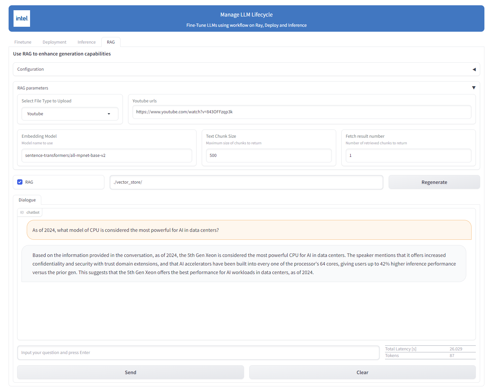

# RecDP LLM - LLM data preparation utility

RecDP LLM provides an easy-to-use Resumable, Data Parallel pipeline, covering all general operations used during LLM data preparation.

## Getting Start

### Deploy
```
DEBIAN_FRONTEND=noninteractive apt-get install -y openjdk-8-jre graphviz
pip install pyrecdp[LLM] --pre
```

## operation list
### Input
| Type                                                                                                                       | notebook                                                                                                                                                                                                   | Description                                               | supports                                             | engine               |
| -------------------------------------------------------------------------------------------------------------------------- | ---------------------------------------------------------------------------------------------------------------------------------------------------------------------------------------------------------- | --------------------------------------------------------- | ---------------------------------------------------- | ------------------------------------- |
| [ Directory Loader ](https://github.com/intel/e2eAIOK/blob/main/RecDP/pyrecdp/primitives/operations/doc_loader.py#L77)                      | [](https://colab.research.google.com/github/intel/e2eAIOK/blob/main/RecDP/examples/notebooks/llmutils/document_extract.ipynb)            | extract text from a directory of files                         | jpg, png, pdf, docx, audio, video                                 | ray, spark                   |
| [ URLLoader ](https://github.com/intel/e2eAIOK/blob/main/RecDP/pyrecdp/primitives/operations/doc_loader.py#L219)                      | [](https://colab.research.google.com/github/intel/e2eAIOK/blob/main/RecDP/examples/notebooks/llmutils/url_loader.ipynb)            | extract text from URL links with specified depth crawling                     | url with depth from 1 - N                                 | ray, spark                   |
| [ Text Reader ](https://github.com/intel/e2eAIOK/blob/main/RecDP/pyrecdp/primitives/operations/text_reader.py#L16)                      | [](https://colab.research.google.com/github/intel/e2eAIOK/blob/main/RecDP/examples/notebooks/llmutils/reader.ipynb)            | Read data from directory                            | jsonl, parquet,                                 | ray, spark                   |
| [ Text Prompt ](https://github.com/intel/e2eAIOK/blob/main/RecDP/pyrecdp/primitives/operations/text_prompt.py)                                                                                                       | [](https://colab.research.google.com/github/intel/e2eAIOK/blob/main/RecDP/examples/notebooks/llmutils/prompt_enhancement.ipynb)      | create prompt for different data source       | PromptSource | ray, spark |
| [ TableSummary ](https://github.com/intel/e2eAIOK/blob/main/RecDP/pyrecdp/primitives/operations/table_summary.py)                                                                                                       | [](https://colab.research.google.com/github/intel/e2eAIOK/blob/main/RecDP/examples/notebooks/llmutils/table_summary.ipynb)      | convert markdown table to a paragraph of text       | alpaca | ray, spark |
| [ TextToQA ](https://github.com/intel/e2eAIOK/blob/main/RecDP/pyrecdp/primitives/operations/text_to_qa.py)                                                                                                       | [](https://colab.research.google.com/github/intel/e2eAIOK/blob/main/RecDP/examples/notebooks/llmutils/text_to_qa.ipynb)      | convert plain text to QnA pairs       | alpaca | ray, spark |


### Output
| Type                                                                                                                       | notebook                                                                                                                                                                                                   | Description                                               | supports                                             | engine               |
| -------------------------------------------------------------------------------------------------------------------------- | ---------------------------------------------------------------------------------------------------------------------------------------------------------------------------------------------------------- | --------------------------------------------------------- | ---------------------------------------------------- | ------------------------------------- |
| [ Writer ](https://github.com/intel/e2eAIOK/blob/main/RecDP/pyrecdp/primitives/operations/text_writer.py#L7)                      | [](https://colab.research.google.com/github/intel/e2eAIOK/blob/main/RecDP/examples/notebooks/llmutils/writer.ipynb)            | write data to directory                            | jsonl, parquet                               | ray, spark                   |
| [ ClassifyWriter ](https://github.com/intel/e2eAIOK/blob/main/RecDP/pyrecdp/primitives/operations/text_writer.py#L47)                      | [](https://colab.research.google.com/github/intel/e2eAIOK/blob/main/RecDP/examples/notebooks/llmutils/classify.ipynb)            | Classify and write data into sub buckets                            | meta fields, language                                | ray, spark                  |

### Filter
| Type                                                                                                                       | notebook                                                                                                                                                                                                   | Description                                               | supports                                             | engine               |
| -------------------------------------------------------------------------------------------------------------------------- | ---------------------------------------------------------------------------------------------------------------------------------------------------------------------------------------------------------- | --------------------------------------------------------- | ---------------------------------------------------- | ------------------------------------- |
| [ Filter ](https://github.com/intel/e2eAIOK/blob/main/RecDP/pyrecdp/primitives/operations/filter.py)                         | [](https://colab.research.google.com/github/intel/e2eAIOK/blob/main/RecDP/examples/notebooks/llmutils/filter.ipynb)              | 13 different types of Filtering                    | profanity-based, perplexity, ngram, bad-word, url_based, length_based, special-char ratio, token count, word count  | ray, spark                      |
| [ Language Identify ](https://github.com/intel/e2eAIOK/blob/main/RecDP/pyrecdp/primitives/operations/text_language_identify.py)   | [](https://colab.research.google.com/github/intel/e2eAIOK/blob/main/RecDP/examples/notebooks/llmutils/language_identify.ipynb)   | Inentify major language type of document                  | en, zh, fr, de, .. total 25 langs                    | ray, spark                      |

### Deduplication
| Type                                                                                                                       | notebook                                                                                                                                                                                                   | Description                                               | supports                                             | engine               |
| -------------------------------------------------------------------------------------------------------------------------- | ---------------------------------------------------------------------------------------------------------------------------------------------------------------------------------------------------------- | --------------------------------------------------------- | ---------------------------------------------------- | ------------------------------------- |
| [ Fuzzy Deduplicator ](https://github.com/intel/e2eAIOK/blob/main/RecDP/pyrecdp/primitives/operations/text_deduplication.py#L99)           | [](https://colab.research.google.com/github/intel/e2eAIOK/blob/main/RecDP/examples/notebooks/llmutils/fuzzy_deduplication.ipynb) | Detect and reduce duplication based on document context   | minHashLSH                     | ray, spark                           |
| [ Global Decuplicator ](https://github.com/intel/e2eAIOK/blob/main/RecDP/pyrecdp/primitives/operations/text_deduplication.py#L194)         | [](https://colab.research.google.com/github/intel/e2eAIOK/blob/main/RecDP/examples/notebooks/llmutils/decontamination.ipynb)     | Detect and reduce duplication based on exact same content | sha256-hash                                          | ray, spark   |
| [ Rouge Score Decuplicator ](https://github.com/intel/e2eAIOK/blob/main/RecDP/pyrecdp/primitives/operations/text_compare_dedup.py#L157)         | [](https://colab.research.google.com/github/intel/e2eAIOK/blob/main/RecDP/examples/notebooks/llmutils/rouge_score_deduplication.ipynb)     | Remove similar data by calculating the rough score                                         | ray, spark   |


### RAG operation
| Type                                                                                                                       | notebook                                                                                                                                                                                                   | Description                                               | supports                                             | Verified dataset & size               |
| -------------------------------------------------------------------------------------------------------------------------- | ---------------------------------------------------------------------------------------------------------------------------------------------------------------------------------------------------------- | --------------------------------------------------------- | ---------------------------------------------------- | ------------------------------------- |
| [ Directory Loader ](https://github.com/intel/e2eAIOK/blob/main/RecDP/pyrecdp/primitives/operations/doc_loader.py#L77)                      | [](https://colab.research.google.com/github/intel/e2eAIOK/blob/main/RecDP/examples/notebooks/llmutils/document_extract.ipynb)            | extract text from a directory of files                         | jpg, png, pdf, docx, audio, video                                 | ray, spark                   |
| [ URLLoader ](https://github.com/intel/e2eAIOK/blob/main/RecDP/pyrecdp/primitives/operations/doc_loader.py#L219)                      | [](https://colab.research.google.com/github/intel/e2eAIOK/blob/main/RecDP/examples/notebooks/llmutils/rag_cnvrg_pipeline.ipynb)            | extract text from URL links with specified depth crawling                     | url with depth from 1 - N                                 | ray, spark                   |
| [ RAG Text Fixer ](https://github.com/intel/e2eAIOK/blob/main/RecDP/pyrecdp/primitives/operations/text_fixer.py#L277)                 | [](https://colab.research.google.com/github/intel/e2eAIOK/blob/main/RecDP/examples/notebooks/llmutils/rag_text_fix.ipynb)          | Clean special character and clean for document split               | html, markdown                                   | ray, spark                  |
| [ Document Split ](https://github.com/intel/e2eAIOK/blob/main/RecDP/pyrecdp/primitives/operations/text_split.py)                      | [](https://colab.research.google.com/github/intel/e2eAIOK/blob/main/RecDP/examples/notebooks/llmutils/document_split.ipynb)            | split documents    |  RecursiveCharacterTextSplit, MarkdownSplit, NLTKTextSplit, SetenceTransformersTokenSplit, pythonCodeSplit, ParagraphSplit | ray, spark                   |
| [ Document Ingestion ](https://github.com/intel/e2eAIOK/blob/main/RecDP/pyrecdp/primitives/operations/text_ingestion.py)                      | [](https://colab.research.google.com/github/intel/e2eAIOK/blob/main/RecDP/examples/notebooks/llmutils/document_ingestion.ipynb)            | embedding documents and store into  vector database                        |  chroma, faiss, elasticsearch                  | ray, spark                   |

### Data Clean
| Type                                                                                                                       | notebook                                                                                                                                                                                                   | Description                                               | supports                                             | engine               |
| -------------------------------------------------------------------------------------------------------------------------- | ---------------------------------------------------------------------------------------------------------------------------------------------------------------------------------------------------------- | --------------------------------------------------------- | ---------------------------------------------------- | ------------------------------------- |
| [ PII Removal ](https://github.com/intel/e2eAIOK/blob/main/RecDP/pyrecdp/primitives/operations/text_pii_remove.py)                | [](https://colab.research.google.com/github/intel/e2eAIOK/blob/main/RecDP/examples/notebooks/llmutils/pii_removal.ipynb)         | Detect and replace personal infomation in document        | email, phone, ip, username, password                 | ray, spark                    |
| [ Text Contraction Remove ](https://github.com/intel/e2eAIOK/blob/main/RecDP/pyrecdp/primitives/operations/text_contraction_remove.py)        | [](https://colab.research.google.com/github/intel/e2eAIOK/blob/main/RecDP/examples/notebooks/llmutils/contraction_remove.ipynb)            | Expand contractions in the text using the contractions library. | | ray, spark                    |
| [ Text Spell Correct ](https://github.com/intel/e2eAIOK/blob/main/RecDP/pyrecdp/primitives/operations/text_spell_correct.py)        | [](https://colab.research.google.com/github/intel/e2eAIOK/blob/main/RecDP/examples/notebooks/llmutils/spelling_correction.ipynb)            | pelling correction for text using library [textblog](https://textblob.readthedocs.io/en/dev/) || ray, spark                    |
| [ Text Fixer ](https://github.com/intel/e2eAIOK/blob/main/RecDP/pyrecdp/primitives/operations/text_fixer.py)                 | [](https://colab.research.google.com/github/intel/e2eAIOK/blob/main/RecDP/examples/notebooks/llmutils/text_fixer.ipynb)          | Clean repeated format in html, latex, codes               | html, latex, codes                                   | ray, spark                    |

### Quality Analysis
| Type                                                                                                                       | notebook                                                                                                                                                                                                   | Description                                               | supports                                             | engine               |
| -------------------------------------------------------------------------------------------------------------------------- | ---------------------------------------------------------------------------------------------------------------------------------------------------------------------------------------------------------- | --------------------------------------------------------- | ---------------------------------------------------- | ------------------------------------- |
| [ Diversity ](https://github.com/intel/e2eAIOK/blob/main/RecDP/pyrecdp/primitives/operations/text_diversityindicate.py)                | [](https://colab.research.google.com/github/intel/e2eAIOK/blob/main/RecDP/examples/notebooks/llmutils/data_diversity_control.ipynb)         | Visualize the diversity distribution of data        | alpaca                 | ray, spark                   |
| [ Quality Scoring ](https://github.com/intel/e2eAIOK/blob/main/RecDP/pyrecdp/primitives/operations/text_qualityscorer.py)                | [](https://colab.research.google.com/github/intel/e2eAIOK/blob/main/RecDP/examples/notebooks/llmutils/text_quality_assessment.ipynb)         | analyze text quality        | GPT-3                  | ray, spark                   |
| [ Toxicity ](https://github.com/intel/e2eAIOK/blob/main/RecDP/pyrecdp/primitives/operations/text_toxicity.py)                | [](https://colab.research.google.com/github/intel/e2eAIOK/blob/main/RecDP/examples/notebooks/llmutils/toxicity_bias_control.ipynb)         | Analyze text toxicity level       | NLP model                 | ray, spark                   |
| [ Perplexity ](https://github.com/intel/e2eAIOK/blob/main/RecDP/pyrecdp/primitives/operations/text_perplexity_score.py)                | [](https://colab.research.google.com/github/intel/e2eAIOK/blob/main/RecDP/examples/notebooks/llmutils/text_perplexity.ipynb)         | Analyze text perplexity   | perplexity score                  | ray, spark                   |
| [ Gopher ](https://github.com/intel/e2eAIOK/blob/main/RecDP/pyrecdp/primitives/operations/filter/text_gopherqualityfilter.py)                | [](https://github.com/intel/e2eAIOK/blob/main/RecDP/pyrecdp/primitives/operations/filter/text_gopherqualityfilter.py)         | Analyze text Quality using Gopher method   | gopher score                  | ray, spark                   |

### User Defined operation
| Type                                                                                                                       | notebook                                                                                                                                                                                                   | Description                                               | supports                                             | engine               |
| -------------------------------------------------------------------------------------------------------------------------- | ---------------------------------------------------------------------------------------------------------------------------------------------------------------------------------------------------------- | --------------------------------------------------------- | ---------------------------------------------------- | ------------------------------------- |
| [ User Defined Transform ](https://github.com/intel/e2eAIOK/blob/main/RecDP/pyrecdp/primitives/operations/text_custom.py)                | [](https://colab.research.google.com/github/intel/e2eAIOK/blob/main/RecDP/examples/notebooks/llmutils/custom_map.ipynb)         | Easy way to plugin user defined map function        | parallel with ray or spark                 | ray, spark                   |
| [ User Defined Filter ](https://github.com/intel/e2eAIOK/blob/main/RecDP/pyrecdp/primitives/operations/text_custom.py)                | [](https://colab.research.google.com/github/intel/e2eAIOK/blob/main/RecDP/examples/notebooks/llmutils/custom_filter.ipynb)         | Easy way to plugin user defined filter function        | parallel with ray or spark                  | ray, spark                   |

## Pipeline

### * RAG Data Pipeline - Build from public HTML [](https://colab.research.google.com/github/intel/e2eAIOK/blob/main/RecDP/examples/notebooks/llmutils/rag_pipeline.ipynb)
Retrieval-augmented generation (RAG) for large language models (LLMs) aims to improve prediction quality by using an external datastore at inference time to build a richer prompt that includes some combination of context, history, and recent/relevant knowledge (RAG LLMs).
Recdp LLM can provide a pipeline for ingesting data from a source and indexing it. We mainly provide the following capabilities.
- **Load Data**: Load your data from source. You can use `UrlLoader` or `DirectoryLoader` for this.
- **Improve Data Quality**: Clean up text for LLM RAG to use. It mainly solves the problem of sentences being split by incorrect line breaks after parsing the file, removing special characters, fixing unicode errors,  and so on.
- **Split Text**: `DocumentSplit` helps break large Documents into smaller chunks. This is useful for indexing data and make it better used by the model.
- **Vector Store**: In order to retrieve your data, We provide `DocumentIngestion` use a VectorStore and Embeddings model to store and index your data.

Here is a basic RAG Data Pipeline example:
```python
from pyrecdp.primitives.operations import *
from pyrecdp.LLM import TextPipeline

pipeline = TextPipeline()
ops = [
    UrlLoader(urls=["https://www.intc.com/news-events/press-releases/detail/1655/intel-reports-third-quarter-2023-financial-results"], max_depth=0, target_tag='div', target_attrs={'class': 'main-content'}),
    DirectoryLoader(files_path, glob="**/*.pdf"),
    RAGTextFix(),
    DocumentSplit(),
    DocumentIngestion(
        vector_store='FAISS',
        vector_store_args={
            "output_dir": "ResumableTextPipeline_output",
            "index": "test_index"
        },
        embeddings='HuggingFaceEmbeddings',
        embeddings_args={
            'model_name': f"{model_root_path}/sentence-transformers/all-mpnet-base-v2"
        }
    ),
]
pipeline.add_operations(ops)
pipeline.execute()
```


### Integrate with LLM-on-Rag WebUI Demo

Currently, the [LLM-on-Ray](https://github.com/intel/llm-on-ray/tree/main) project leverages the RAG capability of Recdp, and users can refer to the **LLM-on-Ray** [documentation](https://github.com/intel/llm-on-ray/blob/main/docs/web_ui.md) to deploy web services.


Currently, Recdp RAG pipeline supports a variety of different file types, including: 
  + Web URL
  + YouTube link
  + pdf
  + doxc
  + jpg/ jped/ png
  + mp3/ wav/ flac

Here are some RAG examples:

####  **YouTube Video**: [Intel’s ‘AI Everywhere’ Event (Replay)](https://www.youtube.com/watch?v=843OFFzqp3k)

  **_Question 1_**: As of 2024, what model of CPU is considered the most powerful for AI in data centers?

  _Answer without RAG_:
  > As of 2024, the most powerful CPU models for AI in data centers are those from NVIDIA, specifically their Tesla V100 and Tesla P40 GPUs. These GPUs are designed for high-performance computing and are optimized for deep learning and AI workloads. They offer a significant increase in performance compared to traditional CPUs, making them the go-to choice for many data centers and AI workloads.However, it's worth noting that CPUs from other manufacturers, such as AMD and Intel, are also...
  
  _Answer with RAG_:
  > Based on the information provided in the conversation, as of 2024, the 5th Gen Xeon is considered the most powerful CPU for AI in data centers. The speaker mentions that it offers increased confidentiality and security with trust domain extensions, and that AI accelerators have been built into every one of the processor's 64 cores, giving users up to 42% higher inference performance versus the prior gen. This suggests that the 5th Gen Xeon offers the best performance for AI workloads in data centers, as of 2024.


  **_Question 2_**: What is the percentage of performance improvement that Gaudi 2 delivers over NVIDIA's H100 for training the 175 billion parameter GPT-3 model, based on the most recent ML perf training benchmarks?

  _Answer without RAG_:
  > The most recent ML perf training benchmarks for Gaudi 2 and H100 are not yet available, as both are relatively new and have only recently been released. However, based on the available information and benchmarks, it is estimated that Gaudi 2 delivers a performance improvement of around 2-3x over H100 for training large language models like GPT-3.Specifically, a recent benchmark by the MLPerf organization showed that Gaudi 2 achieved a training speed of 7.64 TOPS (tera-operations per second) for the GPT-...
  
  _Answer with RAG_:
  > Based on the conversation, Gaudi 2 delivers between 40 to 50% better price performance than NVIDIA's H100 for training the 175 billion parameter GPT-3 model. This means that Gaudi 2 provides a performance improvement of 40-50% compared to H100 for this specific AI workload.


####  **PDF**: [The Gluten Open-Source Software Project: Modernizing Java-based Query Engines for the Lakehouse Era](https://ceur-ws.org/Vol-3462/CDMS8.pdf)

  **_Question 1_**: Can you give me a brief introduction about Gluten?

  _Answer without RAG_:
  > Certainly! Gluten is a type of protein found in certain grains, including wheat, barley, and rye. It gives dough its elasticity and helps it rise, making it an essential component of bread, pasta, and other baked goods. However, for some people, gluten can be problematic, as it can cause an immune response and lead to conditions like celiac disease or non-celiac gluten sensitivity.Here are some key points to know about gluten:1. Gluten is a protein composite: Gluten is made up of two main prote

  **_Answer with RAG_**:
  > Sure, I'd be happy to help! Gluten is a software framework that aims to improve the performance of database query engines by providing a modular and composable architecture for query optimization.In traditional query optimization, a query is executed on a single query engine, and any optimization is applied directly to the query. However, this can lead to inefficient query execution when the query is executed on different query engines, as each engine may have its phylogenetic optimization techniques.Gluten addresses this problem by introducing a new layer of abstraction between the query and the query engine. The Gluten framework


  **_Question 2_**: What are the advantages of Gluten?

  _Answer without RAG_:
  > Gluten is a protein found in certain grains, including wheat, barley, and rye. It has several advantages, including:1. Elasticity: Gluten gives dough its elasticity, which allows it to stretch and hold its shape, making it ideal for baking.2. Structure: Gluten helps create the structure of bread and other baked goods, giving them their texture and consistency.3. Flavor: Gluten can enhance the flavor of bread and other baked goods, particularly when combined with other ingredients like yeast and sugar

  **_Answer with RAG_**:
  > Based on the conversation, the advantages of Gluten are:1. Removes JVM/JDK version dependency: Gluten allows for optimizing Java-based query engines without worrying about the version of JVM/JDK being used, as it can work with any version that supports the Java Virtual Machine (JVM).2. Enables efficient query engine vectorization: With Gluten, query engines can be optimized for vectorization, which can lead to faster execution and better performance. This is achieved through the use of SIMD-based Vector API capabilities in JDK 17, which is not available in earlier


### * Finetune Data Pipeline - Build finetune dataset from Plain Text to QA [](https://colab.research.google.com/github/intel/e2eAIOK/blob/main/RecDP/examples/notebooks/llmutils/text_to_qa.ipynb)

```
from pyrecdp.LLM import TextPipeline
from pyrecdp.primitives.operations import ParquetReader, TextPrompt, TextToQA, ParquetWriter

text_key = "text_prompt"
pipeline = TextPipeline()
ops = [
    ParquetReader(dataset_path),
    TextPrompt(dataset_name="text", prompt_name="generate_qa",new_name=text_key),
    TextToQA(outdir=result_path,text_key=text_key),
    ParquetWriter(result_path)
]
pipeline.add_operations(ops)
pipeline.execute()
```

### * Finetune Data Pipeline - Analysis quality of finetune dataset [](https://colab.research.google.com/github/intel/e2eAIOK/blob/main/RecDP/examples/notebooks/llmutils/downsize_dataset.ipynb)


```
from pyrecdp.LLM import TextPipeline, ResumableTextPipeline
from pyrecdp.primitives.operations import *

import os
pipeline = ResumableTextPipeline()
pipeline.enable_statistics()
ops = [
    JsonlReader("{path-to-e2eAIOK}/RecDP/tests/data/alpaca/alpaca_data_50.jsonl"),
    TextPrompt(dataset_name="alpaca", prompt_name="causal_llm_1"),
    RandomSelect(fraction=0.3),
    TextToxicity(),
    TextDiversityIndicate(out_dir=out_dir, language="en", first_sent=False),
    TextQualityScorer(model="gpt3"),
    RougeScoreDedup(max_ratio=0.7, batch_size=10,score_store_path=os.path.join(out_dir,'RougeScorefiltered.parquet')),
    ParquetWriter("ResumableTextPipeline_output")
]
pipeline.add_operations(ops)
pipeline.execute()
```

### * AutoHPO for high quality Finetune dataset [](https://colab.research.google.com/github/intel/e2eAIOK/blob/main/RecDP/examples/notebooks/llmutils/pipeline_hpo.ipynb)


Low-Code configuration with automated operators parameter tuning, allowing user to transform their own raw data toward a high quality dataset with low-effort. We coupled data processing with Quality Analisys as evaluation metrics, which will estimate data's quality before actual model finetuning/inference

```
from pyrecdp.primitives.llmutils.pipeline_hpo import text_pipeline_optimize

# input data path is configured in input_pipeline_file
input_pipeline_file = "config/pipeline_hpo.yaml.template"
input_hpo_file = 'config/hpo.yaml'
output_pipeline_file = "config/pipeline.yaml"

text_pipeline_optimize(input_pipeline_file, output_pipeline_file, input_hpo_file)
```

## Integrate with your existing Ray and Spark


### * work with existing ray
```
from pyrecdp.primitives.operations import LengthFilter
 
dataset = … # Ray Dataset
op = LengthFilter()
op.process_rayds(dataset)
```

### * work with existing spark
```
from pyrecdp.primitives.operations import LengthFilter

sparkdf = … # Spark Dataframe
op = LengthFilter()
op.process_spark(sparkdf)
```
