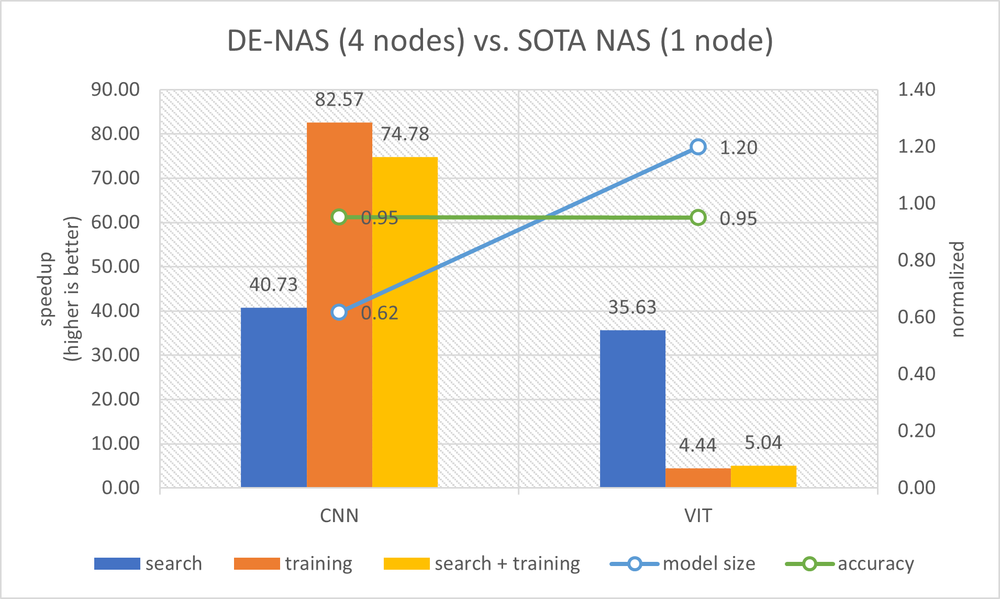
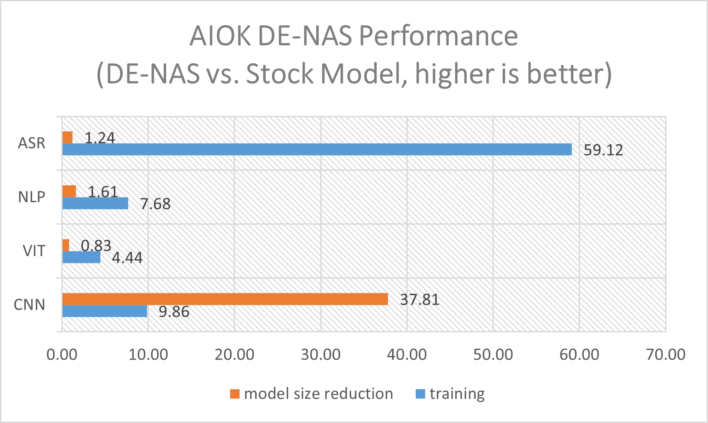

## DE-NAS Performance

Performance results are evaluated on 4-node cluster configured with Intel(R) Xeon(R) Platinum 8358 Scalable processor.
For [DE-NAS](e2eAIOK/DeNas/README.md) CNN and ViT, Intel® End-to-End AI Optimization Kit delivered 40.73x and 35.63x search time speedup, 82.57x and 4.44x training time speedup over [ZenNAS](https://github.com/idstcv/ZenNAS) and [AutoFormer](https://github.com/microsoft/Cream/tree/main/AutoFormer) respectively. For DE-NAS searched CNN, ViT, BERT and ASR model, Intel® End-to-End AI Optimization Kit delivered 9.86x, 4.44x, 7.68x and 59.12x training time speedup with 0.03x, 1.20x, 0.62x and 0.81x model size respectively. Please refer to DE-NAS link for detailed test dataset and test method.

### DE-NAS performance over SOTA NAS
| Model | Search | Training | Model Size Reduction | Accuracy Ratio |
| ----- | --- -----| -------------- |
| CNN | 40.73 | 82.57 | 1.62 | -5% |
| ViT | 35.63 | 4.44 | 0.83 | -5% |

> Noted: SOTA NAS for CNN and ViT are [ZenNAS](https://github.com/idstcv/ZenNAS) and [AutoFormer](https://github.com/microsoft/Cream/tree/main/AutoFormer). Optimized lighter models' accuracy are slightly lower: CNN -5% accuracy, ViT -5% accuracy.

### DE-NAS searched models' performance
| Model | Training | Model Size Reduction | Accuracy Ratio |
| ----- | --- -----| -------------- |
| CNN | 9.86 | 37.81 | -3% |
| ViT | 4.44 | 0.83 | -5% |
| BERT | 7.68 | 1.61 | -4% |
| ASR | 59.12 | 1.24 | 0% |

> Noted: Stock model for CNN, ViT, BERT and ASR are ResNet, AutoFormer, BERT-base and RNN-T. Optimized lighter models' accuracy are slightly lower: CNN -3% accuracy, ViT -5% accuracy, BERT -4% F1 score.

