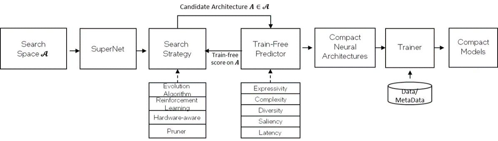

# Multi-model, hardware-aware, train-free NAS (DE-NAS)

## Problem Statement 
Smart Democratization Advisor provides automated model optimization for limited built-in models. However, lots of new domains cannot be supported by SDA. We need a new component to expend the domain coverage in Intel® End-to-End AI Optimization Kit. 
Neural Architecture Search (NAS) is becoming an increasingly important technique for automatic model design because it is capable of design networks that are on-par or outperform hand-designed architectures. However, conventional NAS is mostly targeting for a single domain, which possesses poor ability of cross-domain generalization. Additionally, it is extremely computation intensive due to the large search space and iterative training-based evaluation scheme. 

## Solution 
To resolve those challenges, we proposed a multi-model, hardware aware, train-free NAS named DE-NAS to construct compact (low computation complexity), model architectures for target platform directly. First, DE-NAS constructs compact neural architecture directly from designed search spaces for multiple domains. Then, a hardware-aware search strategy is used based on given budget to determine the best network. Finally, hardware-aware train-free scoring method is designed to evaluate the candidate network’s performance rather than acquire accuracy of each candidate after its training. 

## Personas
This multi-model, hardware-aware train-free NAS solution is targeting for citizen data scientists who wants to build a model for their problems directly. 

## Details 

### Architecture 


DE-NAS: Multi-model, hardware-aware train-free neural architecture search 
One key component of DE-NAS is multi-model and unified search space. Currently Compute Vision (CV), Natural Language Processing (NLP), and Automatic Speech Recognition (ASR) search spaces are supported.
The proposed search strategy generates candidate architecture adaptively based on target-hardware from search space, maximizes the DE-Score to determine the best architecture using on pluggable search strategy and innovatively integrated latency into train-free DE-Score as an indicator. We implement hardware-aware from two perspectives: (1) we added two thresholds for model parameter size and model latency, the underlying search engine will filter out the models suitable for the hardware platform in a coarse-grained manner.
The train-free score uses an innovative, zero-cost “proxy” to predict model accuracy instead of full training and validation. It used a novel zero-cost metric combined Gaussian complexity based on network expressivity, NTK score based on network complexity, nuclear norm score based on network diversity, Synflow score based on network saliency, and latency score. The computation of DE-Score only takes a few forward inferences other than iterative training, making it extremely fast, lightweight, and data-free.


### Geting Started 

#### Environment Setup
``` bash
# Setup ENV
git clone https://github.com/intel/e2eAIOK.git
cd e2eAIOK
git submodule update --init --recursive
python3 scripts/start_e2eaiok_docker.py -b pytorch112 -w ${host0} ${host1} ${host2} ${host3} --proxy ""
```

 Enter Docker
```
sshpass -p docker ssh ${host0} -p 12347
```

Enter DeNas directory
```
cd /home/vmagent/app/e2eaiok/e2eAIOK/DeNas
```
#### Trial for CNN model

```
python -u search.py --domain cnn --conf ../../conf/denas/cv/e2eaiok_denas_cnn.conf
```

#### Trial for ViT model

```
python -u search.py --domain vit --conf ../../conf/denas/cv/e2eaiok_denas_vit.conf
```

##### Trial for Transfomer(Bert) model

```
python -u search.py --domain bert --conf ../../conf/denas/nlp/e2eaiok_denas_bert.conf
```

#### Trial for ASR model

```
python -u search.py --domain asr --conf ../../conf/denas/asr/e2eaiok_denas_asr.conf
```
