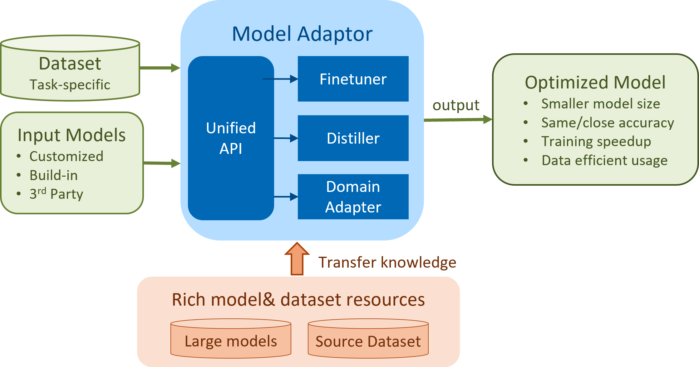

# Intel® End-to-End AI Optimization Kit Model Adaptor
## INTRODUCTION 
### Problem Statement

With the development of deep learning models and growth of hardware computation power, more and more large models have been created. For example, GPT-3 model has 175B parameters, and is trained on 500B dataset. These models, though delivering state of the art results, posed some challenges when adopting it in user environment. For example, high training cost, huge efforts of data labeling, and hard to be deployed in resource constraint environment.

### Intel® End-to-End AI Optimization Kit Model Adaptor
Various technologies have been developed to resolve these challenges. For example, pre-training & fine-tuning [1] can greatly reduce the training cost; knowledge distillation [2] can significantly reduce the hardware resource requirement; besides, domain adaptation[3] can train target model with few-label or even label-free data. We proposed Model Adaptor, providing comprehensive transfer learning optimization technologies via a unified Application Programming Interface (API).

Model Adaptor is targeted to reduce training time and improve inference throughput, data labeling cost by efficiently utilize pre-trained models and datasets from common domains. The objectives are:(1) Transfer knowledge from pretrained model with the same/different network structure, reduce training time without or with minimum accuracy regression. (2) Transfer knowledge from source domain data without target label to target domain data.

### This solution is intended for
This solution is intended for citizen data scientists, enterprise users, independent software vendor and partial of cloud service providers.

## ARCHITECTURE 
### Model Adaptor of Intel® End-to-End AI Optimization Kit
There are three modules in Model Adapter: Finetuner for pretraining & fine-tuning, Distiller for knowledge distillation and Domain Adapter for domain adaption. They shared a unified API and can be easily integrated with existing pipeline with few code changes. Model Adaptor was optimized on CPU clusters for training and inference with Intel optimized frameworks and libraries.

### The key components are

- **Finetuner**: Finetuner uses pretraining and finetuning technology to transfer knowledge from pretrained model to target model with same network structure. Pretrained models usually are generated separately, which is a pre-trained model on specific dataset. Finetuner retrieves the pretrained model with same network structure, and copy pretrained weights from pretrained model to corresponding layer of target model, instead of random initialization for target mode. With this, it can greatly improve training speed and delivers better performance.

- **Distiller**: Distiller uses knowledge distillation technology to transfer knowledge from a heavy model (teacher) to a light one (student) with different structure. Teacher is a large model pretrained on specific dataset, which contains sufficient knowledge for this task, while the student model has much smaller structure. Distiller trains with two losses: one comes from the dataset learning, another is to reduce the gap with teacher predicting, and in this way teacher’s knowledge can quickly guide the learning of student to coverage. Distiller reduces training time significantly, improves model convergence and small models’ predication accuracy. 

- **Domain Adapter**: Domain Adapter is based on domain transfer technology, it can transfer knowledge from source domain (cheap labels) to target domain (few labels or label-free). Directly applying pre-trained model into target domain cannot always work due to covariate shift and label shift, while fine-tuning is also not working due to the expensive labeling in some domains. Even if users invest resource in labeling, it will be time-consuming and delays the model deployment. Adapter aims at reusing the transferable knowledge with the help of another labeled dataset with same learning task. That is, achieving better generalization with little labeled target dataset or achieving a competitive performance in label-free target dataset.



## Getting Started 

### Installation 
```bash
## set env
git clone https://github.com/intel/e2eAIOK.git
cd e2eAIOK
git submodule update --init --recursive
python scripts/start_e2eaiok_docker.py --backend pytorch112 --dataset_path ${dataset_path} --workers ${host1}, ${host2}, ${host3}, ${host4} --proxy "http://addr:ip"

## enter docker
sshpass -p docker ssh ${host0} -p 12347
```

### Quick Start 
- [Finetuner](https://github.com/intel/e2eAIOK/demo/ma/finetuner/Model_Adapter_Finetuner_builtin_resnet50_CIFAR100.ipynb) - Apply finetuner for ResNet50 on CIFAR100 dataset to improve the accuracy.
```bash
python /home/vmagent/app/e2eaiok/e2eAIOK/ModelAdapter/main.py --cfg /home/vmagent/app/e2eaiok/conf/ma/demo/baseline/cifar100_res18.yaml
```

- [Distiller](https://github.com/intel/e2eAIOK/demo/ma/distiller/Model_Adapter_Distiller_builtin_resnet18_CIFAR100.ipynb) - Apply distiller from teacher model ResNet50 to student model ResNet18 on CIFAR100 to guide the learning of small model.
```bash
python /home/vmagent/app/e2eaiok/e2eAIOK/ModelAdapter/main.py --cfg /home/vmagent/app/e2eaiok/conf/ma/demo/distiller/cifar100_kd_res50_res18.yaml
```
 
### API usage for Customized cases

We provide a unified API for all three components to apply different model adapter features to the underlying model, and it can be easily integrated with existing pipeline with few code changes.

#### Finetuner

1. Download the pretrained resnet50 from [ImageNet-21K Pretraining for the Masses](https://miil-public-eu.oss-eu-central-1.aliyuncs.com/model-zoo/ImageNet_21K_P/models/resnet50_miil_21k.pth)[4], which is pretrained on Imagenet21k.

2. Create a transferable model with Model Adaptor Unified API:
    ```python
    model = timm.create_model('resnet50', pretrained=False, num_classes=100)

    pretrained_path = './resnet50_miil_21k.pth' # download path
    pretrained_model = timm.create_model('resnet50', pretrained=False, num_classes=11221)
    pretrained_model.load_state_dict(torch.load(pretrained_path,map_location='cpu')["state_dict"], strict=True)
    finetunner= BasicFinetunner(pretrained_model, is_frozen=False)
    model = make_transferrable_with_finetune(model, loss_fn, finetunner)
    ```
    You can find a complete demo at [finetuner customized demo](https://github.com/intel/e2eAIOK/demo/ma/finetuner/Model_Adapter_Finetuner_customized_resnet50_CIFAR100.ipynb).

#### Distiller

1. Prepare a teacher model, here we select pretrained [vit_base-224-in21k-ft-cifar100 from HuggingFace](https://huggingface.co/edumunozsala/vit_base-224-in21k-ft-cifar100).

2. Create a transferable model with Model Adaptor Unified API:
   ```python
   model = timm.create_model('resnet18', pretrained=False, num_classes=100)

   from transformers import ViTForImageClassification
   teacher_model = AutoModelForImageClassification.from_pretrained("edumunozsala/vit_base-224-in21k-ft-cifar100")
   distiller= KD(teacher_model)
   loss_fn = torch.nn.CrossEntropyLoss()
   model = make_transferrable_with_knowledge_distillation(model, loss_fn, distiller)
   ```
   
   You can find a complete demo at [distiller customized demo](https://github.com/intel/e2eAIOK/demo/ma/distiller/Model_Adapter_Distiller_builtin_resnet18_CIFAR100.ipynb)

***Optimizations: Acceleration with logits saving***

During distillation, teacher forwarding usually takes a lot of time. To accelerate the training process, we can save the predicting logits from teacher in advance and reuse it in later student training. Here is  [logits saving demo](https://github.com/intel/e2eAIOK/demo/ma/distiller/Model_Adapter_Distiller_customized_resnet18_CIFAR100_save_logits.ipynb) and the code for [training with saved logits](https://github.com/intel/e2eAIOK/demo/ma/distiller/Model_Adapter_Distiller_customized_resnet18_CIFAR100_train_with_logits.ipynb)

#### Domain Adapter

1. Create backbone model and discriminator model:
   ```python
   from e2eAIOK.ModelAdapter.backbone.unet.generic_UNet_DA import Generic_UNet_DA
   from e2eAIOK.ModelAdapter.engine_core.adapter.adversarial.DA_Loss import CACDomainAdversarialLoss

   # create backbone
   backbone_kwargs = {...}
   model = Generic_UNet_DA(**backbone_kwargs)

   # create discriminator model
   adv_kwargs = {...}
   adapter = CACDomainAdversarialLoss(**adv_kwargs)
   ```
2. Create a transferable model with Model Adaptor Unified API:
   ```python
   from e2eAIOK.ModelAdapter.engine_core.transferrable_model import TransferStrategy
   transfer_strategy = TransferStrategy.OnlyDomainAdaptionStrategy
   model = make_transferrable_with_domain_adaption(model, adapter, transfer_strategy,...)
   ```
## Demos
### Built-in Demos
- [Model Adapter Overview](https://github.com/intel/e2eAIOK/demo/ma/Model_Adapter_Summary.ipynb) 
- [Finetuner on Image Classification](https://github.com/intel/e2eAIOK/demo/ma/finetuner/Model_Adapter_Finetuner_builtin_resnet50_CIFAR100.ipynb)
- [Distiller on Image Classification](https://github.com/intel/e2eAIOK/demo/ma/distiller/Model_Adapter_Distiller_builtin_resnet18_CIFAR100.ipynb)
- [Domain Adapter on Medical Segmentation](https://github.com/intel/e2eAIOK/demo/ma/adapter/Model_Adapter_Domain_Adapter_builtin_Unet_KITS19.ipynb)

### API usage for Customized usage
- [Finetuner on Image Classification](https://github.com/intel/e2eAIOK/demo/ma/finetuner/Model_Adapter_Finetuner_customized_resnet50_CIFAR100.ipynb)
- [Distiller on Image Classification](https://github.com/intel/e2eAIOK/demo/ma/distiller/Model_Adapter_Distiller_customized_resnet18_CIFAR100.ipynb)
- [Domain Adapter on Medical Segmentation](https://github.com/intel/e2eAIOK/demo/ma/adapter/Model_Adapter_Adapter_customized_Unet_KITS19.ipynb)
   
 # References
[1] He, K., Girshick, R., Doll´ar, P.: Rethinking imagenet pre-training. In: ICCV (2019)

[2] G. Hinton, O. Vinyals, and J. Dean. Distilling the knowledge in a neural network. arXiv preprint arXiv:1503.02531, 2015

[3] Yaroslav Ganin and Victor Lempitsky. Unsupervised domain adaptation by backpropagation. In ICML, pages 325–333, 2015

[4] Tal Ridnik, Emanuel Ben-Baruch, Asaf Noy, and Lihi Zelnik-Manor. Imagenet-21k pretraining for the masses. arXiv:2104.10972, 2021
