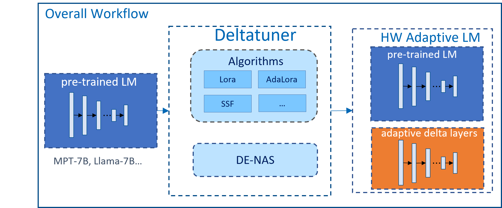

# Deltatuner
Deltatuner is an extension for [Peft](https://github.com/huggingface/peft) to improve LLM fine-tuning speed through multiple optimizations, including leveraging the compact model constructor [DE-NAS](https://github.com/intel/e2eAIOK/tree/main/e2eAIOK/DeNas) to construct/modify the compact delta layers in a hardware-aware and train-free approach and adding more new deltatuning algorithms.

## Introduction
<p align="center">
  
</p>

### Key Components
- Supported parameter efficient finetuning algorithms
  - [LoRA](https://arxiv.org/pdf/2106.09685.pdf) algorithm: It freezes the pre-trained model weights and injects trainable rank decomposition matrices into each layer of the Transformer architecture, greatly reducing the number of trainable parameters for downstream tasks.
  - Scaling and Shifting([SSF](https://arxiv.org/abs/2210.08823)) algorithm: Scale and Shift the deep features in a pre-trained model with much fewer parameters to catch up with the performance of full finetuning
- De-Nas: Automatically construct compact and optimal delta layers with train-free and hardware-aware mode (more details [here](https://community.intel.com/t5/Blogs/Tech-Innovation/Artificial-Intelligence-AI/Multi-Model-Hardware-Aware-Train-Free-Neural-Architecture-Search/post/1479863))
  - step1: Generate search space for delta layers
  - step2: Search algorithm populates delta layers for LM
  - step3: Train-free score evaluates LM with adaptive delta layers

### Features
- Easy-to-use: provide package install; just need to inject a few codes into the original code 
- Auto-tuning: automatically select the best algorithms and delta structure for finetuning model

### Values
- Saving computation power: reduce the computation power and time required to fine-tune a model by reducing parameter size and memory footprint.
- Improve accuracy: ensure the same or no accuracy regression.

## Get Started

### Installation
- install the python package
```shell
pip install e2eAIOK-deltatuner
```

### Fast Fine-tuning on Base models
Below is an example of optimizing [MPT](https://huggingface.co/mosaicml/mpt-7b) model by adding the following few-lines to use the delatuner optimizations. It use the DE-NAS in delatuner to optimize a LLM with LoRA layers to a LLM with compact LoRA layers, so as to efficiently improve the LLM fine-tuning process in peak memory reduction and time speedup. 

```diff
from transformers import AutoModelForCausalLM, AutoTokenizer
from peft import LoraConfig, get_peft_model

# import model from huggingface
model_id =  "mosaicml/mpt-7b"
model = AutoModelForCausalLM.from_pretrained(model_id)
tokenizer = AutoTokenizer.from_pretrained(model_id)

# adding the lora componenents with peft
config = LoraConfig()
lora_model = get_peft_model(model, config) 

# delatuner optimize the model with best lora layer configuration
+ import deltatuner
+ deltatuner_config = {"algo": "lora", "denas": True, "best_model_structure": f"/path/to/best_structure.jsonl"}
+ deltatuner_model = deltatuner.optimize(lora_model, **deltatuner_config)
...
```

### API reference
In above examples, `deltatuner.optimize` is a python function to using deltatuner supported optimization algorithms to optimize the model.
```python
def optimize(model, tokenizer, deltatuning_args=None, **kwargs) -> DeltaTunerModel:
    '''
    Parameters:
        - model - a HuggingFace PreTrainedModel or LoraModel. Specifies the model to be optimized
        - tokenizer - a corresponding tokenizer for text preprocessing, it is optional, and default set to None, if not specify the deltatuning_args.best_model_structure, then tokenizer cannot be ommitted
        - deltatuning_args (optional) – the deltatuner configuration. 
          - deltatuning_args.denas is to use the denas in the optimization (default: True)
          - deltatuning_args.algo Specifies what type of parameter efficient tuning algorithm (default: auto)
            - "auto" – If the input model is mpt, the algorithm is ssf; elif the algorithm is lora
            - "lora" – use the lora algotihm
            - "ssf" – use the ssf algotithm 
          - deltatuning_args.best_model_structure Specifies the pre-searched delta best structure so the model can be directly initialized without searching with DE-Nas algorithm.
        - kwargs - used to initialize deltatuning_args through key=value, such as algo="lora", "denas"=True
    Return 
        DeltaTunerModel - a wrapper of model, which composed of the original properties/function together with advanced properties/function provided by deltatuner
    '''
```


### Detailed examples

Please refer to [example page](https://github.com/intel/e2eAIOK/tree/main/example) for more use cases on fine-tuning other LLMs with the help of DeltaTuner.

## Model supported matrix
We have uploaded the searched delta best structure to the [conf dir](https://github.com/intel/e2eAIOK/tree/main/e2eAIOK/deltatuner/deltatuner/conf/best_structure), so that users can directly use our searched structure for directly fine-tuning by passing the `DeltaTunerArguments.best_model_structure` to the `deltatuner.optimize` function.

### Causal Language Modeling

| Model        | LoRA | SSF  |
|--------------| ---- | ---- |
| GPT-2        | ✅  |  |
| GPT-J        | ✅  | ✅ |
| Bloom        | ✅  | ✅ |
| OPT          | ✅  | ✅ |
| GPT-Neo      | ✅  | ✅ |
| Falcon       | ✅  | ✅ |
| LLaMA        | ✅  | ✅ |
| MPT          | ✅  | ✅ |
